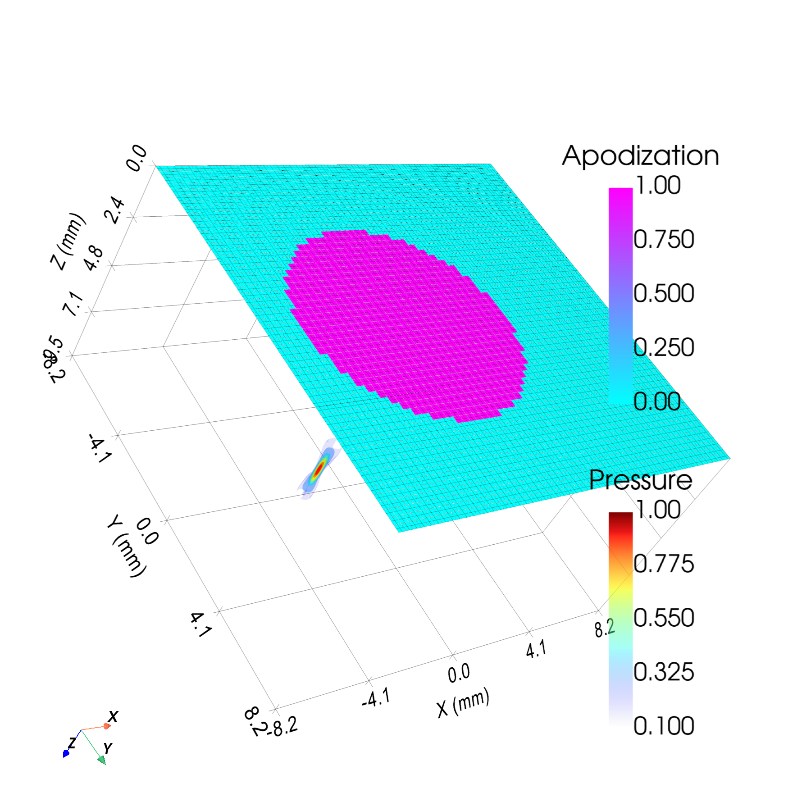
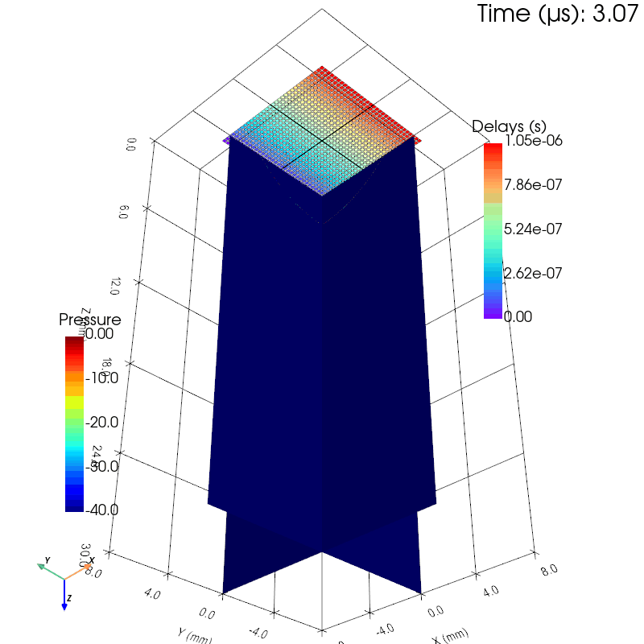
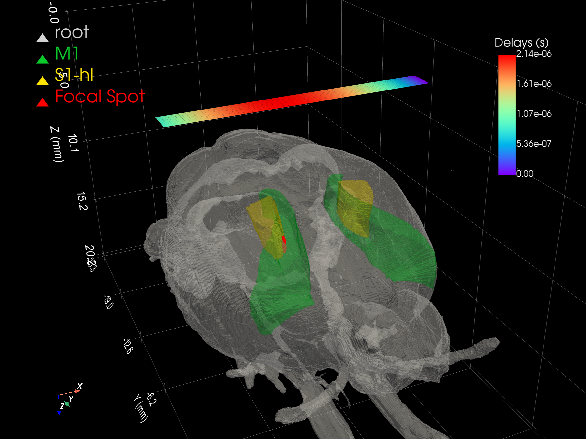
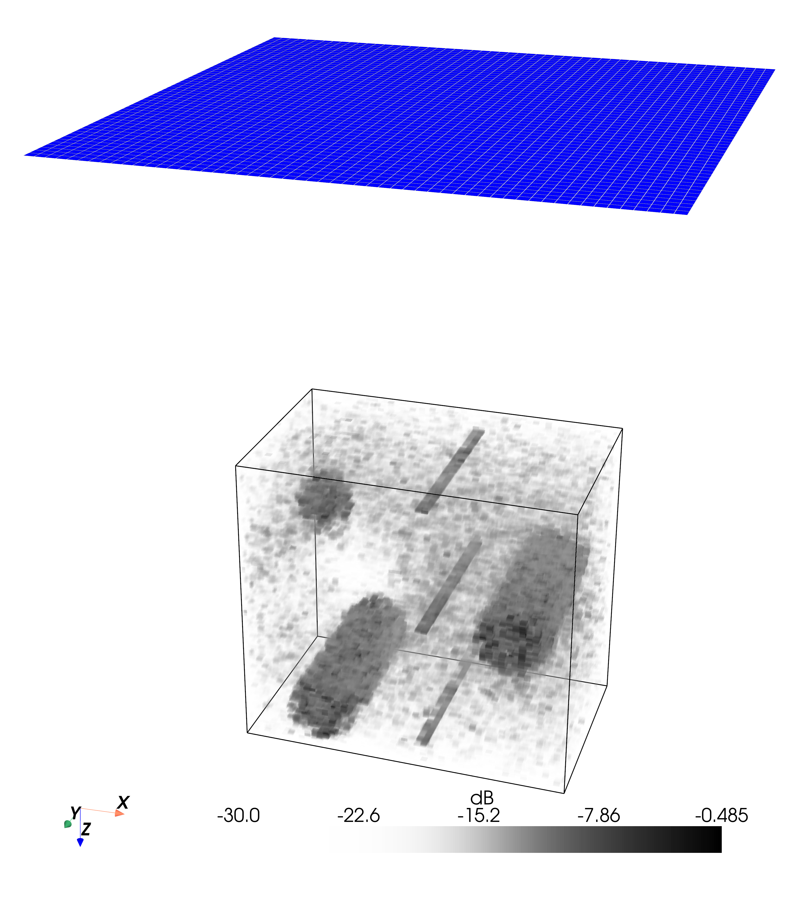

[](https://pypi.org/project/pyfield/)
[](https://pypi.org/project/pyfield/)
[]()
[](https://codecov.io/gh/EstebanRivera08/PyField)
[](https://estebanrivera08.github.io/PyField/)

📖 **Documentation:** <https://estebanrivera08.github.io/PyField/>

> [!WARNING]
> PyField is currently under development. The API is subject to change, and some features may be incomplete or unstable.

PyField is an open‑source Spatial Impulse Response (SIR) and pressure‑field simulation library that supports arbitrary transducer geometries composed of small rectangular patches with apodization and delays.
PyField implements both the Fully Sampled Trapezoid (FST) and the Sparse Delta Integration (SDI) methods for computing SIRs following the Tupholme–Stepanishen formulation.
FST reproduces the classic Field II approach, while SDI is a new, algorithmically and mathematically improved method that computes the same SIRs — under identical assumptions — but substantially faster; an automatic mode picks the best method for each simulation.

> [!NOTE]
> PyField is designed as complementary material to the work presented in [reference]. Its goal is to provide fundamental building blocks that researchers can inspect, reuse, contribute to, or adapt. It also leaves room for community‑driven extensions that integrate naturally with the broader scientific Python ecosystem.
> Utilities such as the integration with the GlobeBrain atlas may still evolve to improve robustness.

### Main Features

- **Transducer objects** — Tools to create and assemble common transducer types: linear arrays, convex arrays, matrix arrays, flat/concave/focused circular transducers, and arbitrary custom arrays. These utilities compute geometric focal laws, generate apodization windows for specified F/D ratios, and more.

- **SIR simulation** — The `H_sir` module computes discrete spatial impulse responses \( h(r, t) \) produced by apertures discretized into rectangular patches. It includes naïve, SDI, and automatic methods implemented with Numba‑accelerated kernels for field‑point‑parallel execution.

- **Pressure simulation** — Converts time‑domain SIRs into acoustic pressure fields. Supports monochromatic fields (spatial‑only) and broadband transient simulations with defined excitation pulses (producing spatio‑temporal pressure matrices).

- **Brain Atlas Integration** — Maps pressure simulations onto standard brain atlases for neuro‑ultrasound research.

- **Visualization** — Rich plotting utilities using Matplotlib and PyVista for visualizing transducers, pressure fields, and brain atlases.

## Gallery

<table>
<tr>
<td width="50%"><br><sub><b>Focused CW field</b> — matrix array</sub></td>
<td width="50%"><br><sub><b>Steered plane wave</b> — 3-D transient</sub></td>
</tr>
<tr>
<td width="50%"><br><sub><b>Transcranial targeting</b> — rat-brain atlas</sub></td>
<td width="50%"><br><sub><b>3-D B-mode volume</b> — Zeus matrix, fast RF + DAS</sub></td>
</tr>
</table>

---

## Installation

### 1. Set up a virtual environment

We recommend installing PyField in a virtual environment to avoid dependency conflicts with other Python packages. Using [uv](https://docs.astral.sh/uv/guides/install-python/), you can create a new project folder with a virtual environment as follows:

```bash
uv init new_project
```

If you already have a project folder, create a virtual environment with:

```bash
uv venv
```

### 2. Install PyField

To install the latest development version from GitHub:

```bash
uv add git+https://github.com/EstebanRivera08/PyField.git
```

PyField will soon be available on PyPI.

### 3. Check installation

Check that PyField is correctly installed by opening a Python interpreter and
importing the package:

```python
import pyfield
```

If no error is raised, you have installed PyField correctly.

---

## Quick Start

```python
from pyfield.emission import Emission
from pyfield.transducers import LinearArrayTransducer
from pyfield.plotting import plot2D_pressure_slices

# Define transducer (mm units; no_sub_x/no_sub_y are keyword-only)
tx = LinearArrayTransducer(
    n_elements=64,
    element_width_mm=0.25,
    element_height_mm=12.0,
    kerf_mm=0.05,
    no_sub_x=2,
    no_sub_y=4,
    frequency_Hz=5e6,
)
tx.compute_delays(focus_mm=[0, 0, 30])
tx.compute_apodization(focus_mm=[0, 0, 30], FoverD=2.0)

# Define field grid
field_points = {
    "x_extent": [-5, 5],
    "y_extent": [-0.5, 0.5],
    "z_extent": [5, 55],
    "dx": 0.1,
    "dy": 1.0,
    "dz": 0.2,
}

# Run a monochromatic (CW) simulation → pressure amplitude at fc
sim = Emission(tx, monochromatic=True)
p, coords = sim(field_points, method="auto")

# Visualize
plot2D_pressure_slices(p, coords=coords, db_scale=True, vmin=-40)
```

From the project folder you can also run the bundled examples directly:

```bash
uv run examples/example03_multielements_monochromatic_CW.py
uv run examples/example04_lineararray_excitation_DW.py
uv run examples/example01_transducer_gallery.py
```

---

## Citing PyField

If you use PyField in your research, please cite it using the following reference:

<!-- citation text will be added here -->

```bibtex
% BibTeX entry will be added here
```
