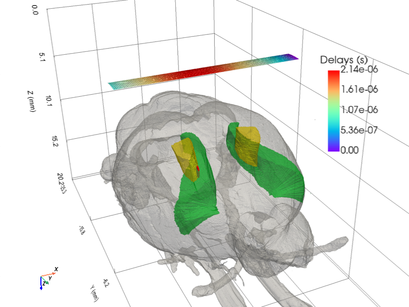
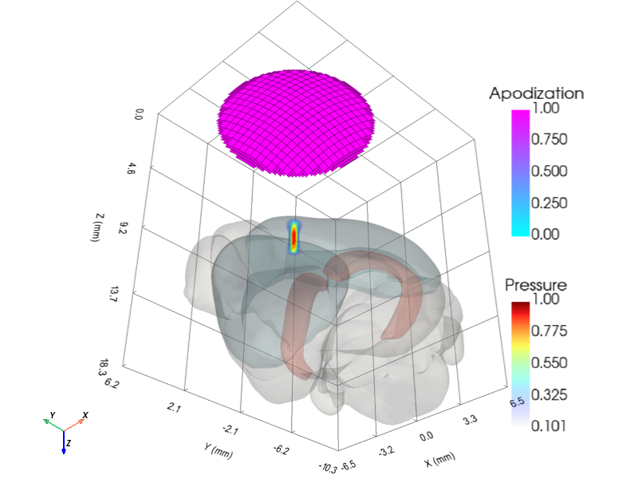

# Brain Atlas

`BG_Atlas` wraps the [BrainGlobe Atlas API](https://brainglobe.info/documentation/brainglobe-atlasapi/index.html)
and adds a registration step that maps atlas voxel coordinates into the
normalised brain space (BPS) used by PyField's coordinate system.

---

## Loading an atlas

```python
from pyfield.brain_atlas.bg_atlas import BG_Atlas

# Show all available atlases
BG_Atlas()

# Load with default region ("root")
atlas = BG_Atlas("whs_sd_rat_39um")

# Load specific regions
atlas = BG_Atlas("whs_sd_rat_39um",
                 region_names=["root", "Hippocampus", "Cortex"])
```

On load, `BG_Atlas`:
1. Downloads the atlas from BrainGlobe if not already cached.
2. Looks up pre-calibrated landmark data in `_ATLAS_LANDMARKS` (see below).
3. Computes the 4×4 affine `bgatlasToBrain` and applies it to the mesh.

---

## Pre-calibrated atlases

| Atlas name | Landmark type |
|-----------|---------------|
| `whs_sd_rat` | `whs_voxels` — origin, bregma, lambda in voxels |
| `allen_mouse` | `manual_fit` — origin voxel + bregma-lambda distance |

For other atlases supply landmarks manually:

```python
# whs_voxels approach
atlas = BG_Atlas("my_atlas", whs_voxels={
    "origin": np.array([244, 623, 248]),
    "bregma": np.array([246, 653, 440]),
    "lambda": np.array([244, 442, 434]),
})

# manual_fit approach
atlas = BG_Atlas("my_atlas", manual_fit={
    "origin": np.array([228, 330, 118]),
    "bregma_lambda_um": 2300,
})
```

To register your atlas permanently, add it to `_ATLAS_LANDMARKS` in
`bg_atlas.py`.

---

## Transforming the mesh

```python
import numpy as np

# Get the atlas-to-brain transform (already applied at load time)
T = atlas.bgatlasToBrain   # (4,4) ndarray

# Transform a copy (non-destructive)
transformed = atlas.transform(T_matrix=my_T)

# Transform in-place
atlas.transform(T_matrix=my_T, inplace=True)

# Reset to the original registration
atlas.reset_mesh()
```

---

## Visualising with PyVista

Compose atlas anatomy, transducer geometry, and pressure field in a single
interactive scene by chaining the PyVista helper functions.

### Rat brain — Domino linear array



```python
import numpy as np
import pyvista as pv
from pyfield.brain_atlas import BG_Atlas
from pyfield.psimulation import PyField
from pyfield.transducers import Domino
from pyfield.utilities import (
    add_pressure_vol, add_regions_mesh, add_transducer_mesh, create_vol_mesh,
)

# ── Atlas ──────────────────────────────────────────────────────────────────
region_names = ("root", "M1", "S1-hl")
atlas = BG_Atlas("whs_sd_rat_39um", region_names=region_names)

# ── Transducer & simulation ────────────────────────────────────────────────
focus_mm = np.array([-1, 0, 8])
tx = Domino()
tx.compute_delays(focus_mm=focus_mm)
tx.compute_apodization(focus_mm=focus_mm, FoverD=1, apodization_type="rect")

sim = PyField(tx)
x, y, z, p = sim({
    "x_extent": [-0.25 + focus_mm[0], 0.25 + focus_mm[0]],
    "y_extent": [-0.5,  0.5],
    "z_extent": [-1.0 + focus_mm[2], 1.0 + focus_mm[2]],
    "dx": 0.0125, "dy": 0.025, "dz": 0.05,
}, method="auto")
pressure_vol = create_vol_mesh(x, y, z, p / p.max(), scalars="Pressure")

# ── Registration (atlas → lab frame) ──────────────────────────────────────
lambda_bregma_mm = 8.0       # rat bregma-lambda distance
cortex2probe_mm  = 4.5       # distance from cortex surface to probe face

scale    = np.eye(4); scale[:3, :3] *= lambda_bregma_mm
z_top    = atlas.pv_mesh["root"].bounds[5]
t_depth  = np.eye(4); t_depth[2, 3] = -cortex2probe_mm - z_top * lambda_bregma_mm
t_xy     = np.eye(4); t_xy[0, 3] = 2.0; t_xy[1, 3] = -2.0
inv_z    = np.diag([1.0, 1.0, -1.0, 1.0])
T        = inv_z @ t_depth @ t_xy @ scale
atlas.transform(T_matrix=T, inplace=True)

# ── Compose scene ──────────────────────────────────────────────────────────
pl = pv.Plotter(window_size=(800, 600))
pl = add_regions_mesh(atlas.pv_mesh, plotter=pl, kwargs_dict={
    region_names[0]: {"color": "lightgray",     "opacity": 0.35},
    region_names[1]: {"color": "permanentgreen", "opacity": 0.5},
    region_names[2]: {"color": "cadmiumlemon",   "opacity": 0.5},
})
pl = add_transducer_mesh(tx.get_mesh(), plotter=pl, scalars="Delays")
pl = add_pressure_vol(pressure_vol, plotter=pl, plot_focal_spot=True)
pl.camera.up = (0, 0, -1)
pl.show()
```

### Mouse brain — circular transducer (TUS)



```python
import numpy as np
import pyvista as pv
from pyfield.brain_atlas import BG_Atlas
from pyfield.psimulation import PyField
from pyfield.transducers import FlatCircularTransducer
from pyfield.utilities import (
    add_pressure_vol, add_regions_mesh, add_transducer_mesh, create_vol_mesh,
)

# ── Atlas ──────────────────────────────────────────────────────────────────
region_names = ("root", "Isocortex", "CA1")
atlas = BG_Atlas("allen_mouse_25um", region_names=region_names)

# ── Transducer & simulation ────────────────────────────────────────────────
focus_mm = np.array([0, 0, 6])
tx = FlatCircularTransducer(diameter_mm=10.0, no_sub=20, frequency_Hz=0.5e6)
tx.compute_delays(focus_mm=focus_mm)
tx.compute_apodization(focus_mm=focus_mm, FoverD=1)

sim = PyField(tx)
x, y, z, p = sim({
    "x_extent": [-3, 3], "y_extent": [-3, 3], "z_extent": [2, 10],
    "dx": 0.1, "dy": 0.1, "dz": 0.1,
}, method="auto")
pressure_vol = create_vol_mesh(x, y, z, p / p.max(), scalars="Pressure")

# ── Registration (atlas → lab frame) ──────────────────────────────────────
lambda_bregma_mm = 4.0       # mouse bregma-lambda distance
cortex2probe_mm  = 2.0

scale   = np.eye(4); scale[:3, :3] *= lambda_bregma_mm
z_top   = atlas.pv_mesh["root"].bounds[5]
t_depth = np.eye(4); t_depth[2, 3] = -cortex2probe_mm - z_top * lambda_bregma_mm
inv_z   = np.diag([1.0, 1.0, -1.0, 1.0])
T       = inv_z @ t_depth @ scale
atlas.transform(T_matrix=T, inplace=True)

# ── Compose scene ──────────────────────────────────────────────────────────
pl = pv.Plotter(window_size=(800, 600))
pl = add_regions_mesh(atlas.pv_mesh, plotter=pl, kwargs_dict={
    region_names[0]: {"color": "lightgray",  "opacity": 0.3},
    region_names[1]: {"color": "lightblue",  "opacity": 0.5},
    region_names[2]: {"color": "salmon",     "opacity": 0.6},
})
pl = add_transducer_mesh(tx.get_mesh(), plotter=pl)
pl = add_pressure_vol(pressure_vol, plotter=pl, plot_focal_spot=True)
pl.camera.up = (0, 0, -1)
pl.show()
```

---

## API reference

| Method | Description |
|--------|-------------|
| `set_bgatlas(name, ...)` | Reload with a different atlas |
| `get_bgatlasToBrain(bg_atlas, ...)` | Compute the registration matrix |
| `get_pv_mesh_from_atlas(bg_atlas, names)` | Load region meshes from atlas |
| `transform(T_matrix, pv_mesh, inplace)` | Apply a transform to the mesh dict |
| `reset_mesh()` | Reload and re-register to `bgatlasToBrain` |
| `summary()` | Print object state |
| `clean()` | Release mesh and atlas objects |
| `show_atlases()` | List all BrainGlobe atlases |
