# Transducers

Every transducer in PyField is built from rectangular patches.  The patch
geometry is stored in three arrays:

| Attribute | Shape | Description |
|-----------|-------|-------------|
| `sub_quad_verts` | `list[(4,3)]` | Four corner vertices per patch (metres) |
| `sub_area` | `list[float]` | Area of each patch (m²) |
| `sub_el_idx` | `list[int]` | Element index of each patch |

These are lazy properties — computed on first access and cached.

---

## Array transducers

### LinearArrayTransducer

1-D row of rectangular elements along the x-axis.  Supports an optional
cylindrical elevation lens.

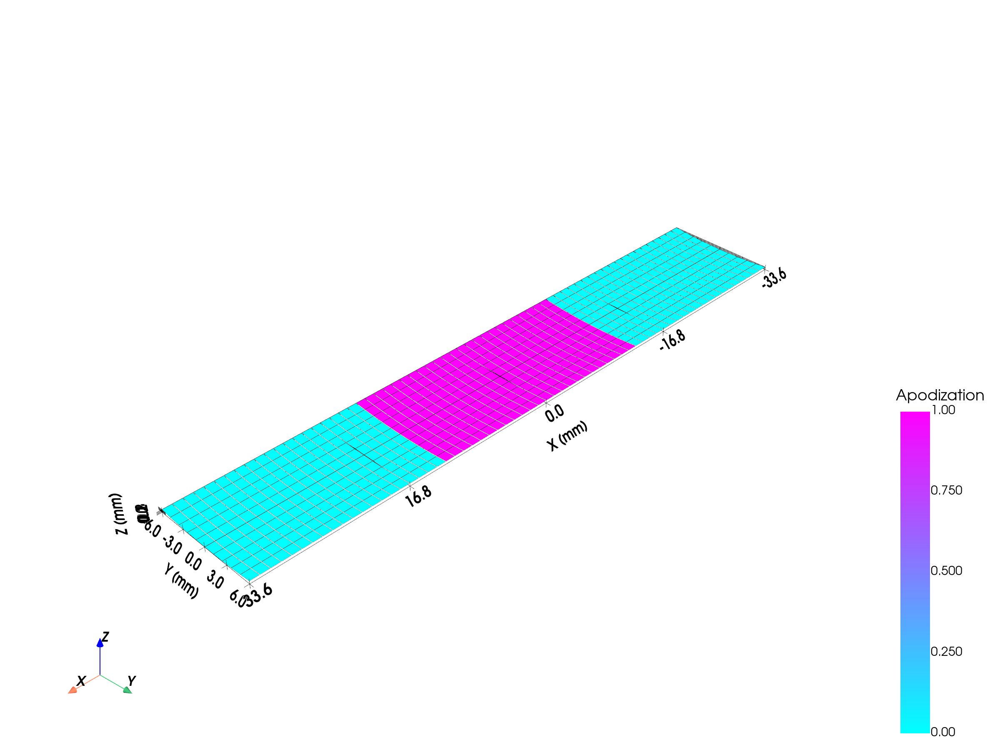


```python
from pyfield.transducers import LinearArrayTransducer

tx = LinearArrayTransducer(
    n_elements=64,
    element_width_mm=0.25,        # element pitch dimension (azimuth)
    element_height_mm=12.0,       # element height (elevation)
    kerf_mm=0.05,                 # gap between elements
    no_sub_x=2,                   # patches per element along azimuth
    no_sub_y=4,                   # patches per element along elevation
    frequency_Hz=5e6,
    elevation_focus_mm=None,      # None = flat; float = cylindrical lens radius
)
tx.compute_delays(focus_mm=[0, 0, 40])
tx.compute_apodization(focus_mm=[0, 0, 40], FoverD=2.0, apodization_type="hanning")
```

### ConvexArrayTransducer

Elements arranged on a convex cylindrical arc in the XZ plane — the standard
geometry for abdominal, cardiac, and obstetric probes.  Supports an optional
elevation focus (acoustic lens), equivalent to FIELD II `xdc_focused_convex`.

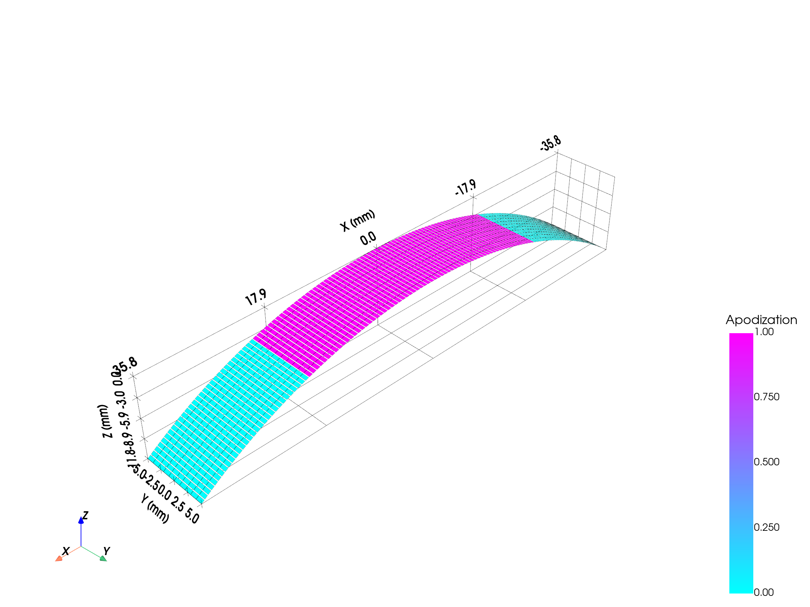
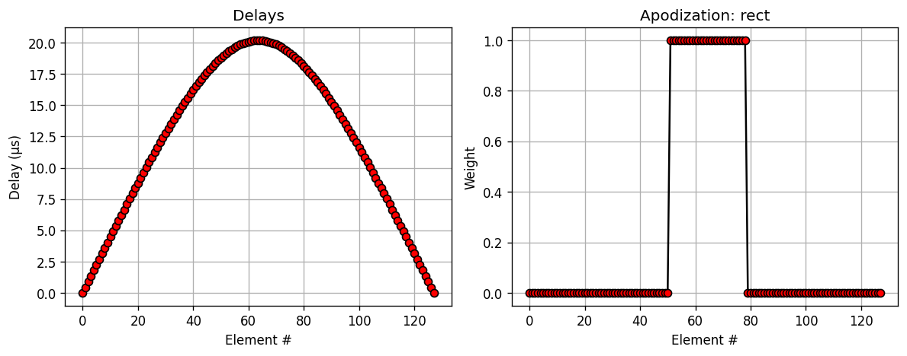

```python
from pyfield.transducers import ConvexArrayTransducer

# Plain convex probe
tx = ConvexArrayTransducer(
    n_elements=128,
    element_width_mm=0.5,
    element_height_mm=10.0,
    kerf_mm=0.1,
    radius_of_curvature_mm=60.0,  # convex arc radius (larger = flatter)
    no_sub_x=2,
    no_sub_y=4,
    frequency_Hz=3.5e6,
)

# Focused convex probe (with elevation lens)
tx_focused = ConvexArrayTransducer(
    n_elements=128,
    element_width_mm=0.5,
    element_height_mm=10.0,
    kerf_mm=0.1,
    radius_of_curvature_mm=60.0,
    no_sub_x=2,
    no_sub_y=4,
    elevation_focus_mm=60.0,      # geometric line focus in elevation at 60 mm
    frequency_Hz=3.5e6,
)
tx.compute_delays(focus_mm=[0, 0, 60])
tx.compute_apodization(focus_mm=[0, 0, 60], FoverD=1.5)
```

### MatrixArrayTransducer


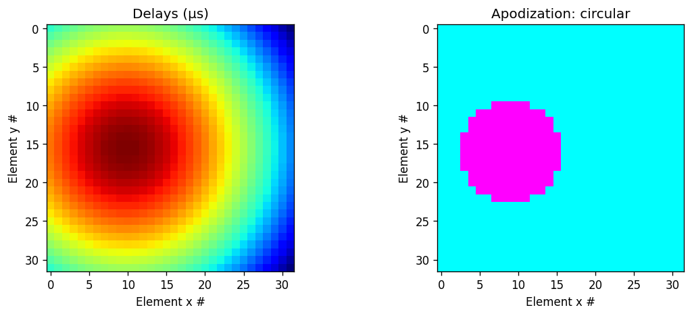

2-D grid of rectangular elements.  Independent kerf in x and y.  Both
`element_width_mm` and `element_height_mm` accept either a scalar (uniform
elements) or a 1-D array (per-column or per-row size variation).

```python
from pyfield.transducers import MatrixArrayTransducer

# Uniform elements
tx = MatrixArrayTransducer(
    n_elements_x=16,
    n_elements_y=16,
    element_width_mm=0.3,
    element_height_mm=0.3,
    kerf_x_mm=0.05,
    kerf_y_mm=0.05,
    no_sub_x=2,
    no_sub_y=2,
    frequency_Hz=3e6,
)

# Non-uniform column widths
import numpy as np
tx_var = MatrixArrayTransducer(
    n_elements_x=16,
    n_elements_y=16,
    element_width_mm=np.linspace(0.25, 0.35, 16),   # wider toward edges
    element_height_mm=0.3,
    kerf_x_mm=0.05,
    kerf_y_mm=0.05,
    no_sub_x=2,
    no_sub_y=2,
    frequency_Hz=3e6,
)
tx.compute_delays(focus_mm=[0, 0, 30])
tx.compute_apodization(focus_mm=[0, 0, 30], FoverD=1.5)
```

---

## Mono-element transducers

These transducers have `n_elements = 1`.  `compute_delays` always returns
`[0.0]`; focusing is purely geometric (curved surface) or achieved through the
excitation pulse.

### FlatCircularTransducer — flat piston

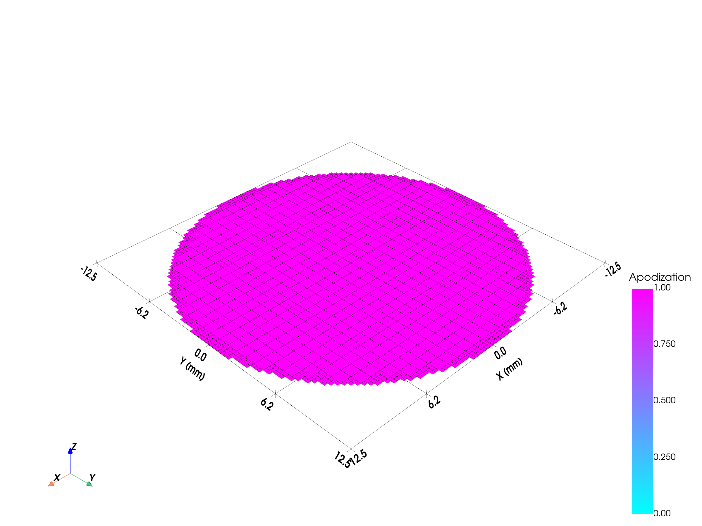

```python
from pyfield.transducers import FlatCircularTransducer

tx = FlatCircularTransducer(
    diameter_mm=25.0,
    no_sub=30,          # patches across diameter
    frequency_Hz=1e6,
)
```

The circular aperture is approximated by keeping only patches whose centre
falls within the disc.  Increasing `no_sub` improves accuracy near the face.

### ConvexCircularTransducer — spherical dome

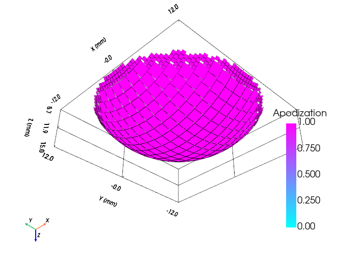

```python
from pyfield.transducers import ConvexCircularTransducer

tx = ConvexCircularTransducer(
    diameter_mm=30.0,
    radius_of_curvature_mm=25.0,
    no_sub=30,
    frequency_Hz=1.5e6,
)
```

The dome surface is defined by `z(x,y) = sag − (R − √(R² − x² − y²))`,
placing the apex at `z = sag` and the rim at `z = 0`.  The virtual focus is
behind the transducer at `z = −R`.

### ConcaveCircularTransducer — spherical bowl (TUS / HIFU)

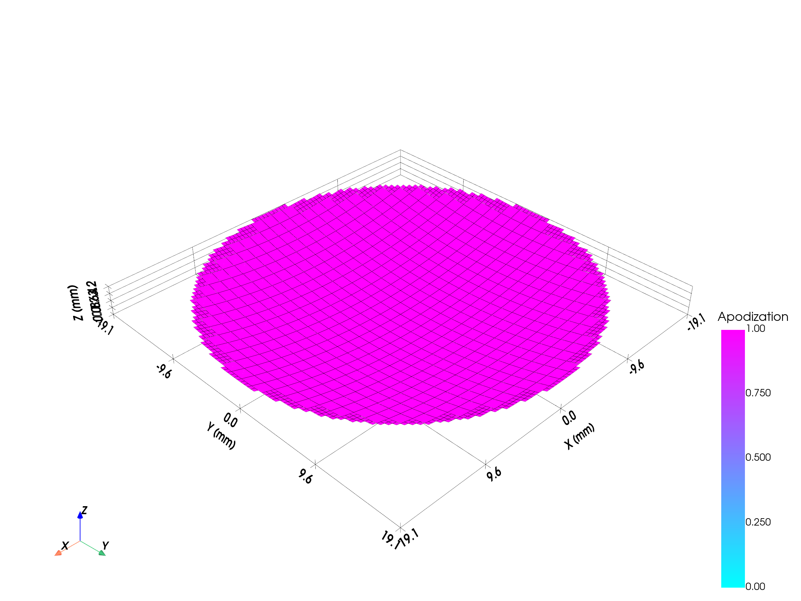

```python
from pyfield.transducers import ConcaveCircularTransducer

tx = ConcaveCircularTransducer(
    diameter_mm=40.0,
    radius_of_curvature_mm=60.0,   # geometric focus at 60 mm depth
    no_sub=30,
    frequency_Hz=0.5e6,
)
```

The curved surface is defined by `z(x,y) = R - sqrt(R² - x² - y²)`, so every
patch is equidistant from the focus at `(0, 0, R)`.

### FocusedCircularTransducer — line focus (cylindrical)

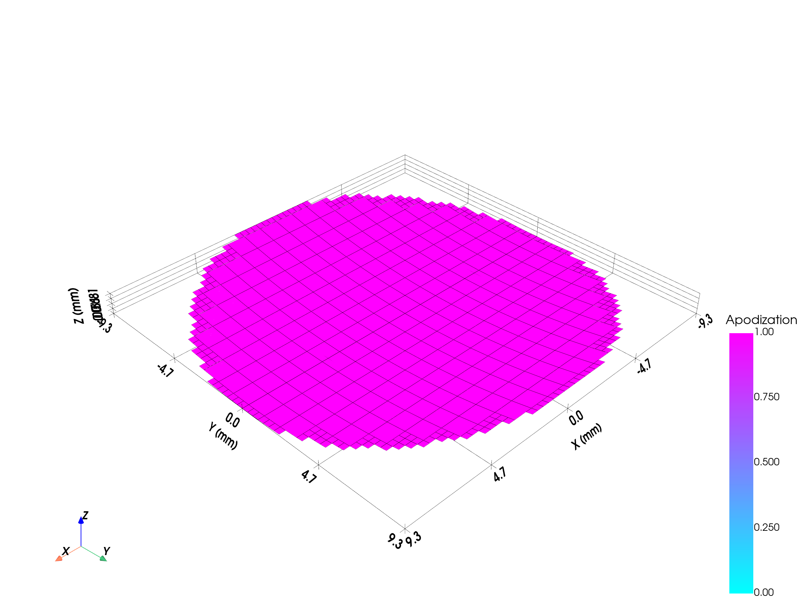

Circular disk aperture curved in **one axis only**.  Produces a line focus
instead of a point focus.  Useful for 2-D cross-sectional imaging or
line-focused therapeutic ultrasound.

```python
from pyfield.transducers import FocusedCircularTransducer

tx = FocusedCircularTransducer(
    diameter_mm=20.0,
    radius_of_curvature_mm=40.0,
    no_sub=20,
    focus_axis="y",    # "x" or "y" — axis along which the aperture is curved
    frequency_Hz=2e6,
)
```

The curvature follows `z(val) = R - sqrt(R² - val²)` where `val` is the x-
or y-coordinate of each patch corner.  The centre is at z = 0; outer edges
are lifted toward z > 0.

---

## Composite arrays

### CustomTransducer — arbitrary multi-element arrays

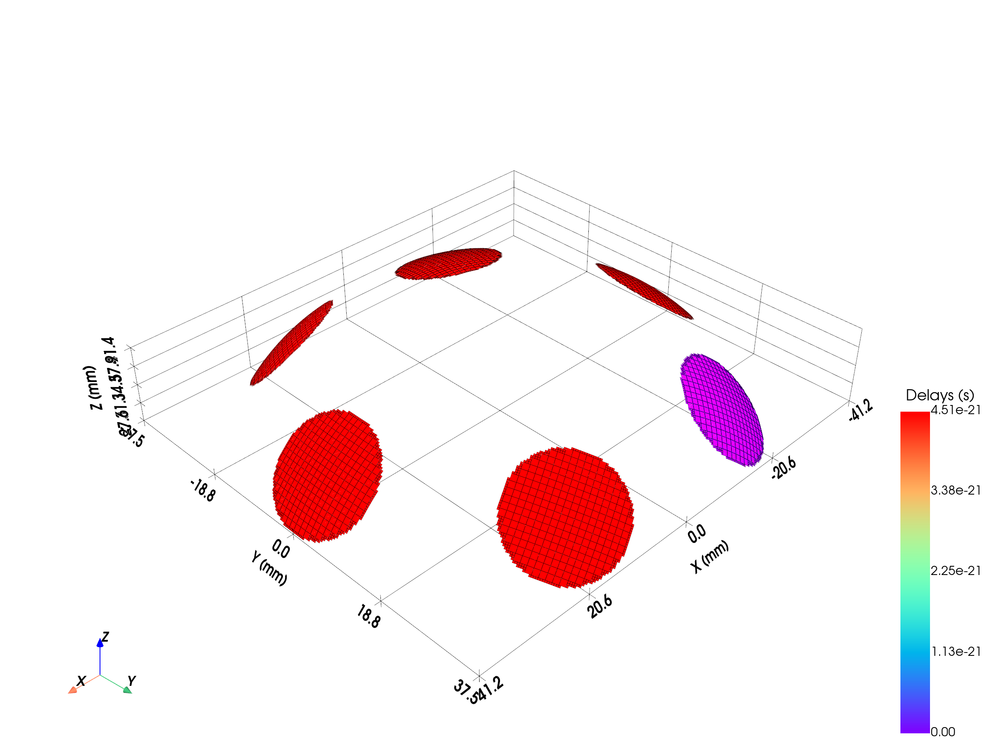

Assemble any number of mono-element transducers at arbitrary positions and
orientations.  Useful for TUS helmets, ring arrays, or any non-rectangular
layout.

```python
import numpy as np
from pyfield.transducers import ConcaveCircularTransducer, CustomTransducer

# Prototype element
elem = ConcaveCircularTransducer(diameter_mm=20, radius_of_curvature_mm=40,
                                  no_sub=20, frequency_Hz=0.5e6)

# 8 elements on a hemisphere, all aimed at the origin
R = 60.0   # mm
phi = np.linspace(0, 2*np.pi, 8, endpoint=False)
theta = np.deg2rad(40)
positions_mm = R * np.column_stack([
    np.sin(theta)*np.cos(phi),
    np.sin(theta)*np.sin(phi),
    np.cos(theta)*np.ones(8),
])
normals = -positions_mm / np.linalg.norm(positions_mm, axis=1, keepdims=True)

helmet = CustomTransducer(
    elements=[elem] * 8,
    positions_mm=positions_mm,
    normals=normals,
)
helmet.compute_delays(focus_mm=[0, 0, 0])
```

---

## Pre-defined transducers

| Name | Description |
|------|-------------|
| `Domino` | 128-element clinical linear array |
| `Zeus_Matrix` | 55×55 matrix research array |

```python
from pyfield.transducers import Domino, Zeus_Matrix

tx = Domino()
```

---

## Common API

All transducers share the following methods:

| Method | Description |
|--------|-------------|
| `compute_delays(focus_mm)` | Distance-based transmit delays (seconds) |
| `compute_apodization(focus_mm, FoverD)` | F/D aperture selection + windowing |
| `set_delays(delays)` | Override delays manually |
| `set_apodization(weights)` | Override apodization manually |
| `get_mesh()` | Build PyVista PolyData with Delays/Apodization data |
| `show(scalars)` | Quick interactive visualisation |
| `plot_delays_apodization()` | Matplotlib 1-D or 2-D summary |
| `clean()` | Free cached geometry |
| `get_state_dict()` / `set_state_dict()` | Serialise / restore |

### Factory function

```python
from pyfield.transducers import create_transducer

tx = create_transducer("flat_circular", diameter_mm=25.0, no_sub=30, frequency_Hz=1e6)
```

Available kind strings: `"linear"`, `"convex"`, `"matrix"`, `"flat_circular"`,
`"concave_circular"`, `"focused_circular"`.

### Far-field condition

Each transducer prints the far-field limit at init:

```
patch_size² / (4λ) << min_field_distance
```

If this condition is violated the SIR approximation loses accuracy.  Decrease
`no_sub_x` / `no_sub_y` or increase the field distance.

---

## Special utilities

### Curved surface patch subdivision

The SIR method requires every patch to be a **flat rectangle**.  On a
curved transducer surface, placing flat rectangles so they neither overlap nor
leave large gaps is non-trivial, especially when the surface curves sharply
near the rim.  PyField handles this automatically via
`pyfield.utilities.surface_subdivision.subdivide_parametric_surface`.

#### How it works

The curved surface is approximated by a mosaic of small **flat tangent-plane
rectangles**.  At each patch centre `r(uc, vc)` an orthonormal frame
`(tu, tv, n)` is estimated by central finite differences and Gram-Schmidt
orthogonalisation — no analytic derivatives needed.  The four corners are
then:

```
corners = { r(uc, vc) ± wu/2 · tu ± wv/2 · tv }
```

`wu`, `wv` (physical widths in metres) are passed directly to the SIR kernel.
The patch width in the u-direction is proportional to the local arc-length
metric:

```
wu_half = ‖∂r/∂u‖ × (Δu / 2)
```

where `‖∂r/∂u‖ = 1` on a flat surface and grows toward the rim on curved
surfaces (e.g. `1/cos θ` for a spherical cap).  Coverage is reported as

```
coverage = Σᵢ (wuᵢ × wvᵢ) / ∫∫ ‖∂r/∂u × ∂r/∂v‖ du dv
```

Values above 1 are possible — they mean the flat patches sum to more area
than the curved surface they approximate (not physical overlap).  See
[`surface_subdivision.py`](../src/pyfield/utilities/surface_subdivision.py)
for the full implementation.

#### Two-mode curvature strategy

A naïve uniform grid in parameter space causes patches to become oversized
near the rim of a spherical cap, where the arc-length amplification
`||∂r/∂u||` can be much greater than 1.  PyField automatically selects
between two strategies based on the measured worst-case amplification:

| Mode | Condition | Grid | Patch size |
|------|-----------|------|------------|
| **Low curvature** | `max ‖∂r/∂u‖ ≤ curvature_threshold` | Uniform Cartesian | Full arc-length `wu = ‖∂r/∂u‖ × Δu` — near-perfect tiling, `patch_fill` ignored |
| **High curvature** | `max ‖∂r/∂u‖ > curvature_threshold` | Arc-length adapted | `patch_fill × ‖∂r/∂u‖ × Δu_cell` — scaled to prevent physical overlap |

In **low-curvature mode** the surface is gentle enough that a full arc-length
patch (one that spans the entire cell) produces near-zero gaps and negligible
second-order overlap.  `patch_fill` has no effect in this mode.

In **high-curvature mode** the grid is resampled so that patch centres are
**uniformly spaced in arc-length** on the surface, regardless of local
curvature.  The arc-length adapted cell edges are found by numerically
inverting the cumulative arc-length function:

```
L(u) = ∫_{u₀}^{u} ‖∂r/∂u(s, v_mid)‖ ds        (total arc-length from u₀ to u)
```

`L(u)` is approximated by a fine numerical quadrature (≥ 500 intervals).
The `n` cell edges are then placed at the parameter values `uₖ` satisfying
`L(uₖ) = k × L(u₁) / n` for k = 0, …, n — i.e. at equal arc-length
increments of `arc_spacing = L(u₁) / n`.  The same procedure is applied
independently in v.  This ensures that near the rim, where `‖∂r/∂u‖` is
large, cells are automatically narrower in parameter space so that each cell
spans the same arc-length as a centre cell.

Each patch is then sized to `patch_fill` times the actual arc-length cell
width — see [Choosing `patch_fill`](#choosing-patch_fill) below.  Patches
whose arc-length amplification exceeds `max_patch_scale` are rejected
entirely, leaving intentional holes at extreme rims rather than producing
oversized or overlapping patches.

#### Tuning parameters

`ConcaveCircularTransducer`, `ConvexCircularTransducer`, and
`FocusedCircularTransducer` all expose the following tunable parameters:

| Parameter | Default | Effect |
|-----------|---------|--------|
| `patch_fill` | `1.0` | *High-curvature mode only.* Fraction of the arc-length cell filled by each patch. `1.0` → patches touch along the arc; values below 1 add a uniform gap. See [Choosing `patch_fill`](#choosing-patch_fill). |
| `max_patch_scale` | `3.0` | Patches whose local arc-length amplification `‖∂r/∂u‖` exceeds this factor are discarded. Lower → more aggressive rejection; higher → keep more rim patches. |
| `curvature_threshold` | `1.1` | Maximum arc-length amplification allowed before switching from low- to high-curvature mode. Raise to keep more surfaces in low-curvature mode (faster, no gaps); lower to detect and handle curvature earlier. |
| `filled_radius_with_big_patches` | `0.95` | Fraction of the aperture radius tiled with coarse patches. The outer ring (`1 − filled_radius`) is always subdivided by `border_refine` for a smoother circular boundary. |

```python
from pyfield.transducers import ConcaveCircularTransducer

# Tight hemisphere — rim half-angle ≈ 53° → high-curvature mode triggered
tx = ConcaveCircularTransducer(
    diameter_mm=60.0,
    radius_of_curvature_mm=37.5,  # R ≈ D/2 → deep bowl
    no_sub=30,
    patch_fill=0.9,         # 10% gap per edge → coverage ≈ 81%
    max_patch_scale=2.5,    # reject strongly amplified rim patches sooner
    frequency_Hz=0.5e6,
)
```

At construction PyField prints a coverage summary:

```
  Patches: 684 accepted / 706 attempted, 22 rejected (oversized)  |  Coverage: 73.4%
```

#### Choosing `patch_fill`

The purpose of `patch_fill` is different depending on the curvature mode.

**Low-curvature mode** — `patch_fill` is ignored.  The function always uses
the full arc-length cell width so adjacent patches tile seamlessly with
negligible second-order overlap.  Clinical transducers (large radius of
curvature relative to aperture diameter) typically fall into this mode.

**High-curvature mode** — on a strongly curved surface, two adjacent flat
patches each spanning the full arc-length cell physically intersect in 3-D.
Even though their *centres* are uniformly spaced along the arc, the flat
rectangles are tilted relative to each other by the surface's dihedral angle,
and their corners protrude into the neighbouring patch.  `patch_fill` shrinks
each patch so it stays within its own "lane" on the surface.

The geometric overlap scales quadratically with patch size, so halving
`patch_fill` reduces the overlap by ~4×.  Coverage scales as `patch_fill²`:
`0.5` → ~25 %, `0.7` → ~49 %, `0.9` → ~81 %.

Practical starting points:

- Start with `patch_fill = 1.0`.  If the visualisation shows physical patch
  intersection (corners of one patch protruding into its neighbour), reduce
  in steps of 0.1 until intersections disappear.
- **Coarser grids need a smaller `patch_fill`** because each patch subtends
  a larger angle and the tilt mismatch between neighbours is greater.
- Use `max_patch_scale` to discard the steepest rim cells rather than
  compensating with a very small `patch_fill`.

#### Using the subdivision function directly

`subdivide_parametric_surface` is public and can be called for any custom
parametric surface — it is not limited to circular transducers.

```python
import numpy as np
from pyfield.utilities.surface_subdivision import subdivide_parametric_surface

# Ellipsoidal cap: z(x, y) = c * sqrt(1 - x²/a² - y²/b²)
a, b, c = 30e-3, 20e-3, 15e-3   # semi-axes in metres
R_ap = 15e-3                      # aperture radius (circular mask)

def ellipsoid_cap(x, y):
    arg = max(1.0 - (x / a) ** 2 - (y / b) ** 2, 0.0)
    return np.array([x, y, c * np.sqrt(arg)])

# This cap has strong curvature → high-curvature mode is triggered.
#
# patch_fill = 0.5: each patch fills only half the arc-length cell in
# each direction (coverage ≈ 25 %).  Using patch_fill = 1.0 would cause
# the flat patches to physically intersect in 3-D — the surface curves
# enough between adjacent centres that full-width flat rectangles
# protrude into their neighbours.  With a coarse grid (n_u = n_v = 10),
# 0.5 is the empirically safe value for this geometry; a finer grid
# would allow a higher patch_fill.
#
# max_patch_scale = 1.5: conservatively rejects the steepest rim cells.
frames = subdivide_parametric_surface(
    ellipsoid_cap,
    u_range=(-R_ap, R_ap),
    v_range=(-R_ap, R_ap),
    n_u=10, n_v=10,
    inside_fn=lambda x, y: x ** 2 / a ** 2 + y ** 2 / b ** 2 <= 1.0,
    normal_sign=1.0,
    patch_fill=0.5,
    max_patch_scale=1.5,
)

# frames is a dict with keys:
#   'corners'    — list of (4,3) arrays, one per patch (corner vertices in metres)
#   'centers'    — (M,3) patch centres on the surface
#   'normals'    — (M,3) unit outward normals
#   'tangents_u' — (M,3) first tangent axis
#   'tangents_v' — (M,3) second tangent axis (orthogonal to normal and tu)
#   'wu', 'wv'   — (M,) half-widths of each patch (metres)
#   'el_idx'     — (M,) element index per patch (all 0 for single-element)
#   'coverage'   — fraction of theoretical surface area covered by patches
#   'n_rejected' — number of patches rejected due to max_patch_scale
```

The returned `frames` dict is exactly what the circular transducers store
internally in `_sub_patch_frames`.  You can inspect it to verify the tiling,
compute coverage statistics, or visualise individual patch frames before
running a full SIR simulation.

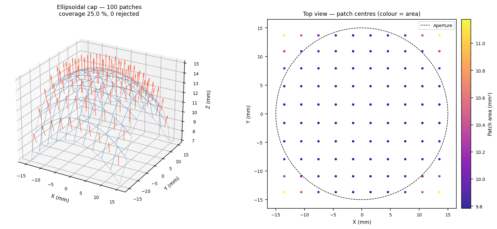

The left panel shows the 3-D patch mosaic with outward normals (red arrows)
and flat rectangular patches (blue edges) laid in the local tangent plane at
each centre.  The right panel is a top-down view of the same subdivision
coloured by individual patch area, illustrating that the arc-length adapted
grid keeps patch centres equidistant across the aperture — including near the
rim — while the circular aperture mask cleanly removes patches outside the
boundary.

The figure below overlays the two representations directly in 3-D:

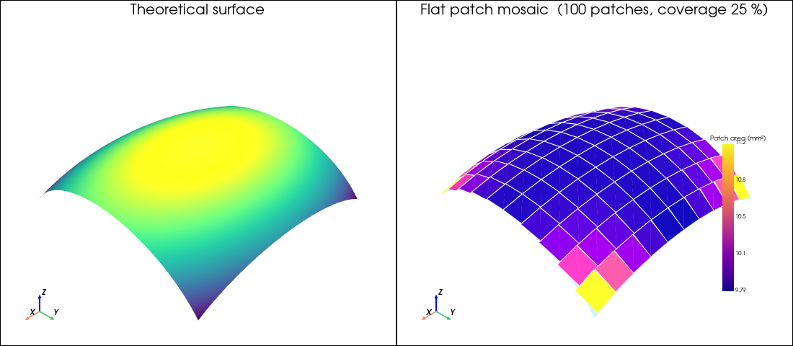

**Left** — the theoretical ellipsoidal cap surface coloured by height.
**Right** — the flat patch mosaic (coloured by area) with the theoretical
surface shown as a semi-transparent overlay (cyan).  The mismatch between the
flat patches and the curved surface explains why the coverage metric can exceed
100 %: each patch is a rectangle in the *local tangent plane*, so near the
centre (where curvature is low) patches sit almost on the surface and their
combined area matches it well, while toward the rim the patches lift slightly
above the curved surface and their flat areas sum to more than the actual
curved area.  The coverage metric therefore reflects how completely the *solid
angle* of the aperture is represented, not physical overlap in 3-D.
