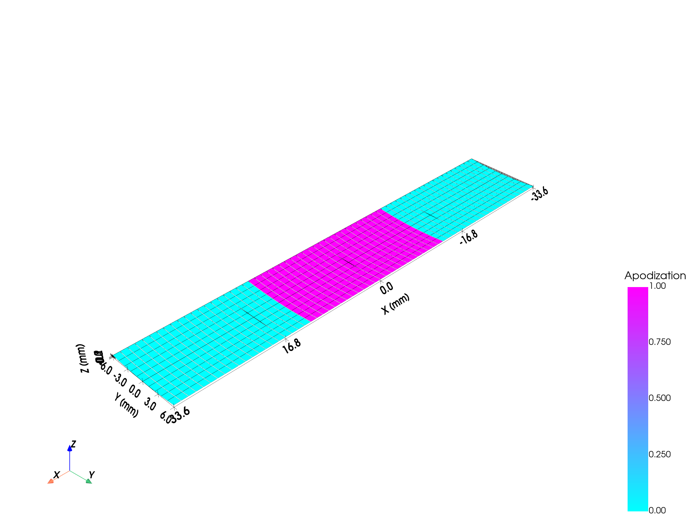
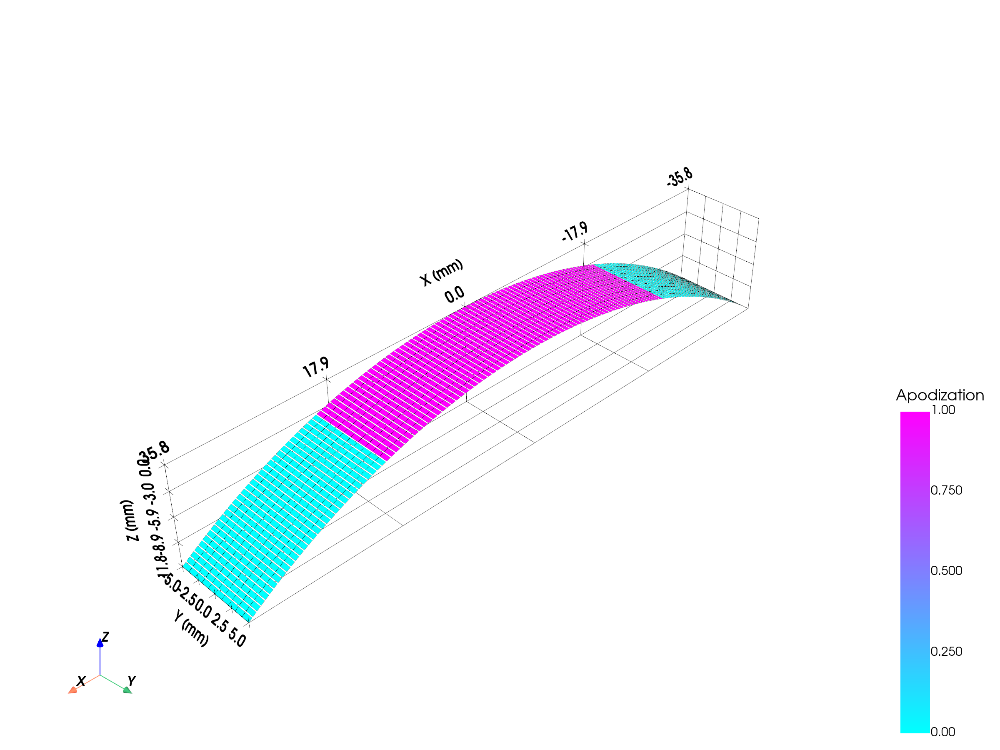
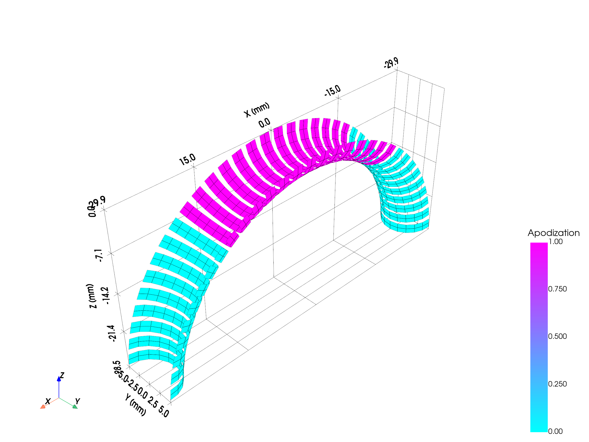
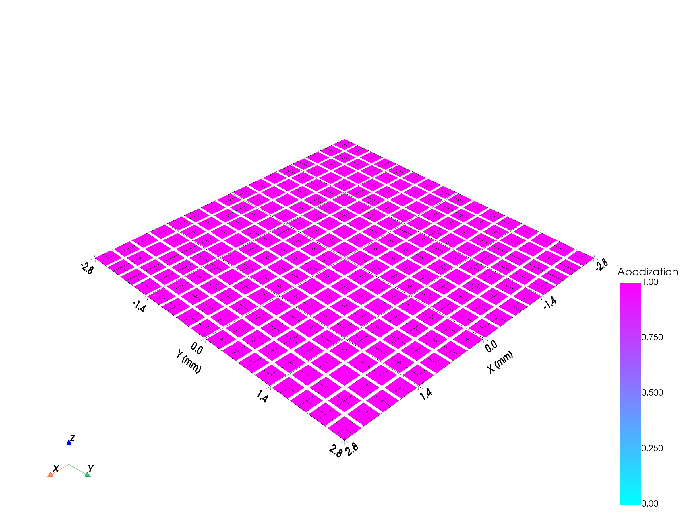
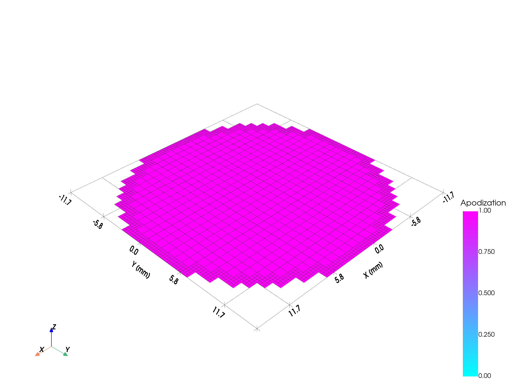
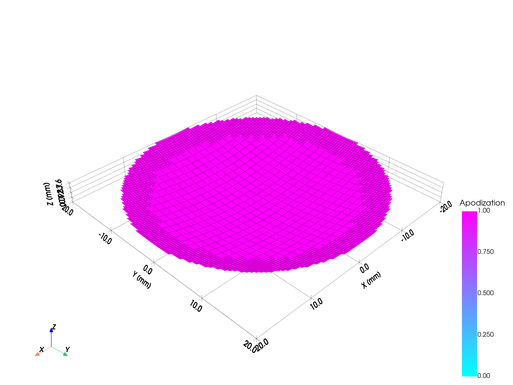
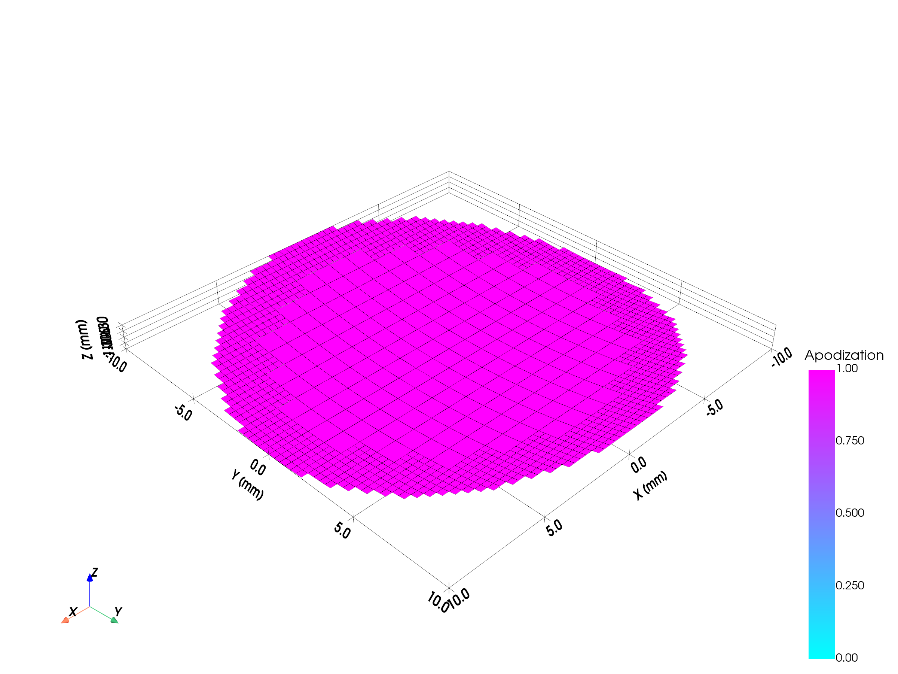
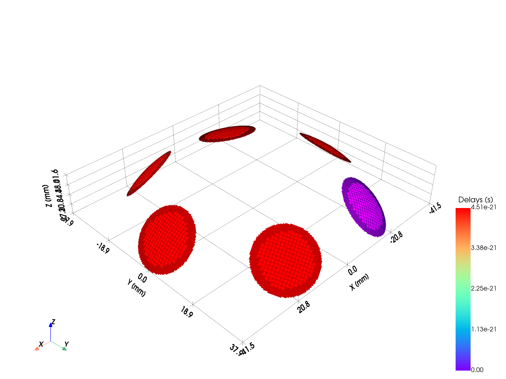

# Example 1: Transducer Gallery

Demonstrates every transducer type available in `sondi.transducers` — from
flat linear arrays to custom multi-element helmets.

## What you will learn

- How to instantiate each transducer class with representative parameters
- Computing electronic delays and apodization for multi-element arrays
- 3-D geometry visualisation with PyVista

## Transducers covered

1. **LinearArrayTransducer** — 1-D row of rectangular elements with optional elevation lens
2. **ConvexArrayTransducer** — curvilinear (abdominal-probe) element layout
3. **MatrixArrayTransducer** — 2-D grid of rectangular elements
4. **FlatCircularTransducer** — flat piston disc (mono-element)
5. **ConcaveCircularTransducer** — spherically curved bowl (TUS / HIFU)
6. **FocusedCircularTransducer** — circular aperture with single-axis curvature
7. **CustomTransducer** — helmet assembled from several bowl elements

## Output










## Run it

```bash
uv run examples/example01_transducer_gallery.py
```

## Key code

```python
from sondi.transducers import LinearArrayTransducer

linear = LinearArrayTransducer(
    n_elements=64,
    element_width_mm=1,
    element_height_mm=12.0,
    kerf_mm=0.05,
    no_sub_x=1,
    no_sub_y=10,
    frequency_Hz=1.5e6,
    elevation_focus_mm=60.0,
)
linear.compute_delays(focus_mm=[0, 0, 50])
linear.compute_apodization(focus_mm=[0, 0, 50], FoverD=2.0)
linear.show(scalars="Apodization")
```

[View full script on GitHub](https://github.com/EstebanRivera08/SonDI/blob/main/examples/example01_transducer_gallery.py)
