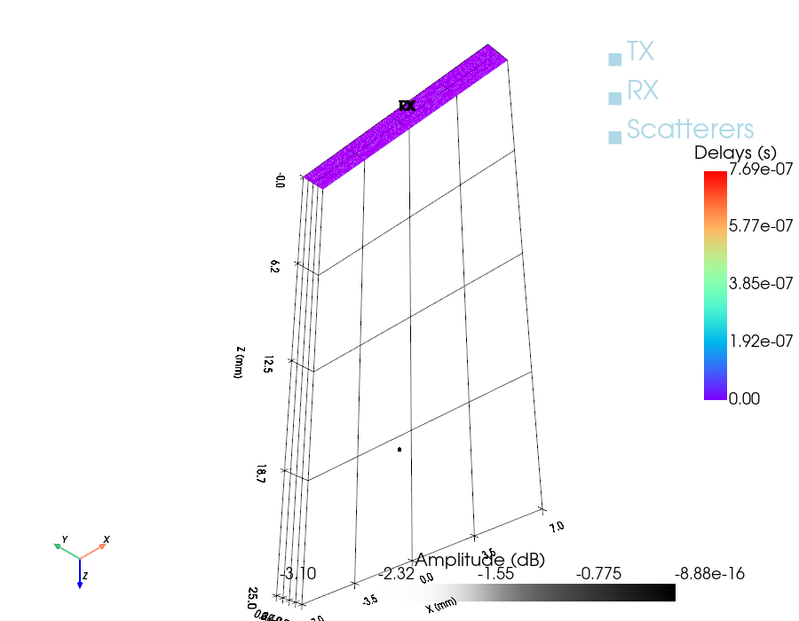
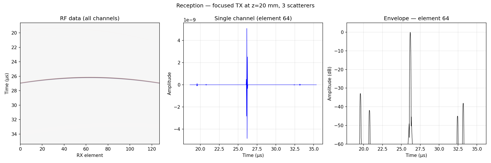

# Example 7: Linear Array — Focused TX, All-RX Reception

Pulse-echo simulation with a focused transmit and all receive channels
recording: the standard single-line acquisition of conventional B-mode
imaging. Includes the `sim.show()` 3-D preview of the full setup.

## What you will learn

- TX and RX as two transducer objects with independent delay laws
- `sim.show(scatterers, amplitudes)` — 3-D preview before simulating
- Per-channel RF data `(E_rx, Nt)` and its time axis from `coords`
- RF waterfall, single-channel trace, and log-envelope displays

## Output




## Run it

```bash
uv run examples/example07_lineararray_TXfocus_RXall.py
```

## Key code

```python
import pyfield.transducers as transducers
from pyfield.reception import ReceptionSDI

tx = transducers.Domino()
tx.compute_delays(focus_mm=[0, 0, 20])
tx.compute_apodization(focus_mm=[0, 0, 20], FoverD=2.0)
rx = transducers.Domino()          # flat reception — no delays

sim = ReceptionSDI(tx, rx, c=1540, fs=200e6, excitation=excitation)
sim.show(scatterer_pos, scatterer_amp)   # 3-D sanity check
rf, coords = sim(scatterer_pos, scatterer_amp)   # (E_rx, Nt)
```

[View full script on GitHub](https://github.com/EstebanRivera08/PyField/blob/main/examples/example07_lineararray_TXfocus_RXall.py)
