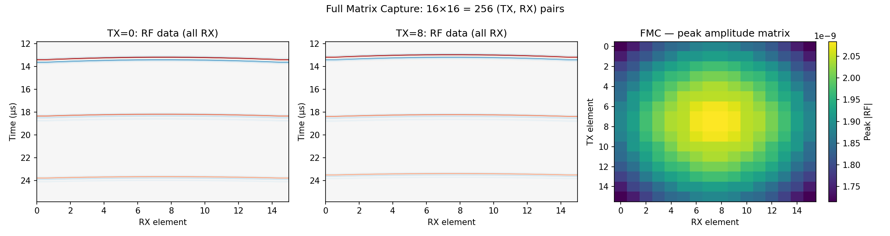

# Example 8: Full Matrix Capture (FMC)

Each transmit element fires individually while all receive elements record —
the complete `(E_tx, E_rx, Nt)` dataset behind synthetic aperture (SA) and
total focusing method (TFM) imaging.

## What you will learn

- `synthetic_aperture_rf()` — the Field II `calc_scat_all` equivalent
- FMC dataset shape `(E_tx, E_rx, Nt)` and its `decimation` option
- Visualising per-TX RF panels and the peak-amplitude TX×RX matrix

## Output



## Run it

```bash
uv run examples/example08_synthetic_aperture.py
```

## Key code

```python
from pyfield.reception import Reception
from pyfield.transducers import LinearArrayTransducer

tx = LinearArrayTransducer(n_elements=16, element_width_mm=0.3,
                           element_height_mm=5.0, kerf_mm=0.05,
                           no_sub_x=1, no_sub_y=4, frequency_Hz=5e6)
tx.excitation = excitation
rx = tx                                   # same aperture for TX and RX

sim = Reception(tx, rx, c=1540, fs=100e6)
rf_fmc, coords = sim.synthetic_aperture_rf(scatterer_pos, scatterer_amp,
                                           decimation=1)
# rf_fmc.shape = (E_tx, E_rx, Nt)
```

[View full script on GitHub](https://github.com/EstebanRivera08/PyField/blob/main/examples/example08_synthetic_aperture.py)
