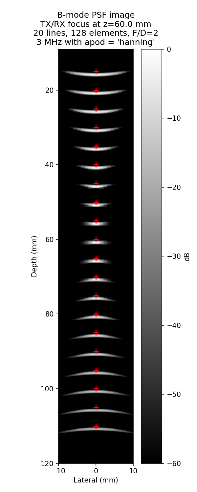

# Example 9: B-mode PSF Image via Focused Scan Lines

The classic Field II PSF phantom: 20 on-axis point scatterers imaged line by
line with a fixed-focus 128-element array. Each lateral position is one
`scan_focusline` call — TX focusing, RX beamforming, and envelope detection
happen inside the kernel, exactly like Field II's `calc_scat` loop.

## What you will learn

- `scan_focusline(focus_mm, scatterers, amps, FoverD, apodization_type)` —
  one focused, apodized, RX-beamformed B-mode line per call
- Mapping each line's `coords["t0"]` time axis to display depth
- Global log compression into a 60 dB B-mode image

## Output



## Run it

```bash
uv run examples/example09_lineararray_imagePSF.py
```

## Key code

```python
from pyfield.reception import ReceptionSDI

sim = ReceptionSDI(tx, rx, c=1540, fs=100e6, excitation=pulse)

env_lines = []
for x in x_lines_mm:
    env, coords = sim.scan_focusline(
        [x, 0.0, 60.0], scatterer_pos, scatterer_amp,
        FoverD=2.0, apodization_type="hanning",
    )
    depth_mm = (coords["t0"] + np.arange(len(env)) * coords["dt"]) * 1540 / 2 * 1e3
    env_lines.append(np.interp(common_depth_mm, depth_mm, env, left=0, right=0))

bmode = 20 * np.log10(np.maximum(np.stack(env_lines, 1) / peak, 1e-3))
```

[View full script on GitHub](https://github.com/EstebanRivera08/PyField/blob/main/examples/example09_lineararray_imagePSF.py)
