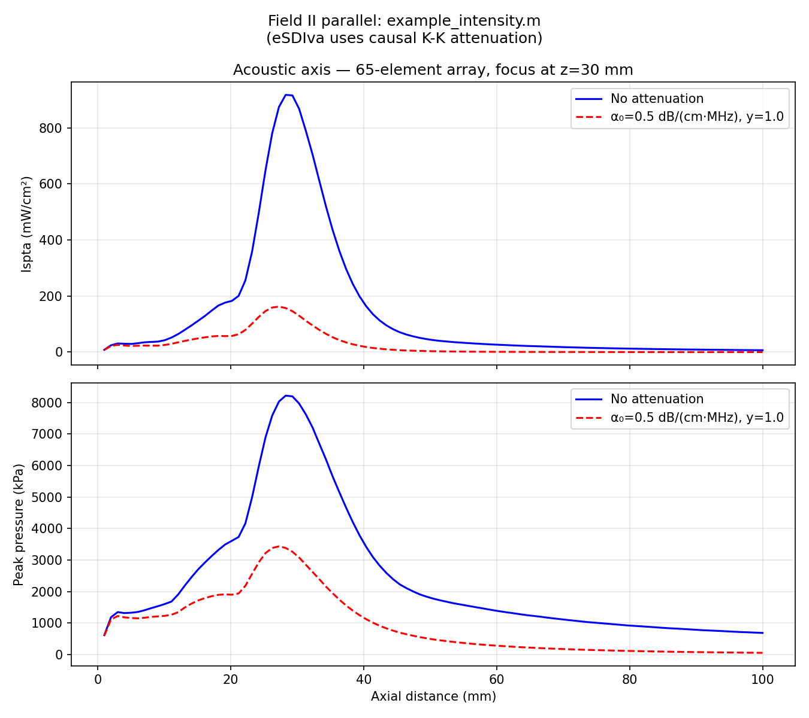

# Example 10: Peak Pressure and Ispta Along the Acoustic Axis

On-axis peak pressure and spatial-peak temporal-average intensity (Ispta)
versus depth for a focused linear array, with and without tissue attenuation
— the quantities behind acoustic-output safety metrics (FDA/IEC).

Field II parallel: `example_intensity.m`. eSDIva uses causal power-law
attenuation with Kramers–Kronig dispersion instead of Field II's non-causal
linear-frequency approximation.

## What you will learn

- Transient emission on an on-axis line grid
- Enabling attenuation with `Emission(alpha0=..., freq_power=...)`
- Computing peak pressure and Ispta from the pulsed field

## Output



## Run it

```bash
uv run examples/example10_intensities_peak_pressure.py
```

## Key code

```python
from esdiva.emission import Emission

sim = Emission(tx, fs=200e6, excitation=pulse, rho=1000.0,
               alpha0=0.5, freq_power=1.0)     # dB/(cm·MHz^y)
p, coords = sim(axial_line)                     # (Nt, 1, 1, Nz)

peak = np.abs(p[:, 0, 0, :]).max(axis=0)        # (Nz,) peak pressure
ispta = (p[:, 0, 0, :] ** 2).sum(axis=0) / (2 * Z_acoustic * fs * T_prf)
```

[View full script on GitHub](https://github.com/EstebanRivera08/eSDIva/blob/main/examples/example10_intensities_peak_pressure.py)
