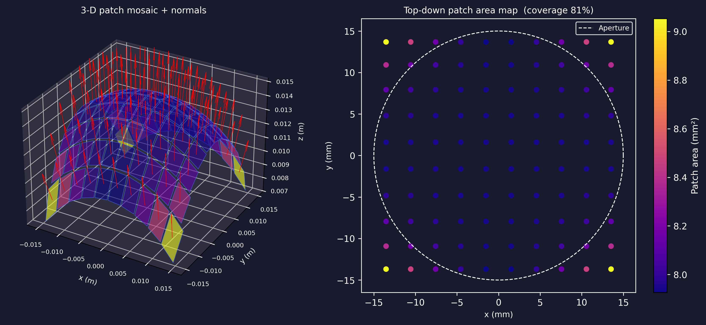
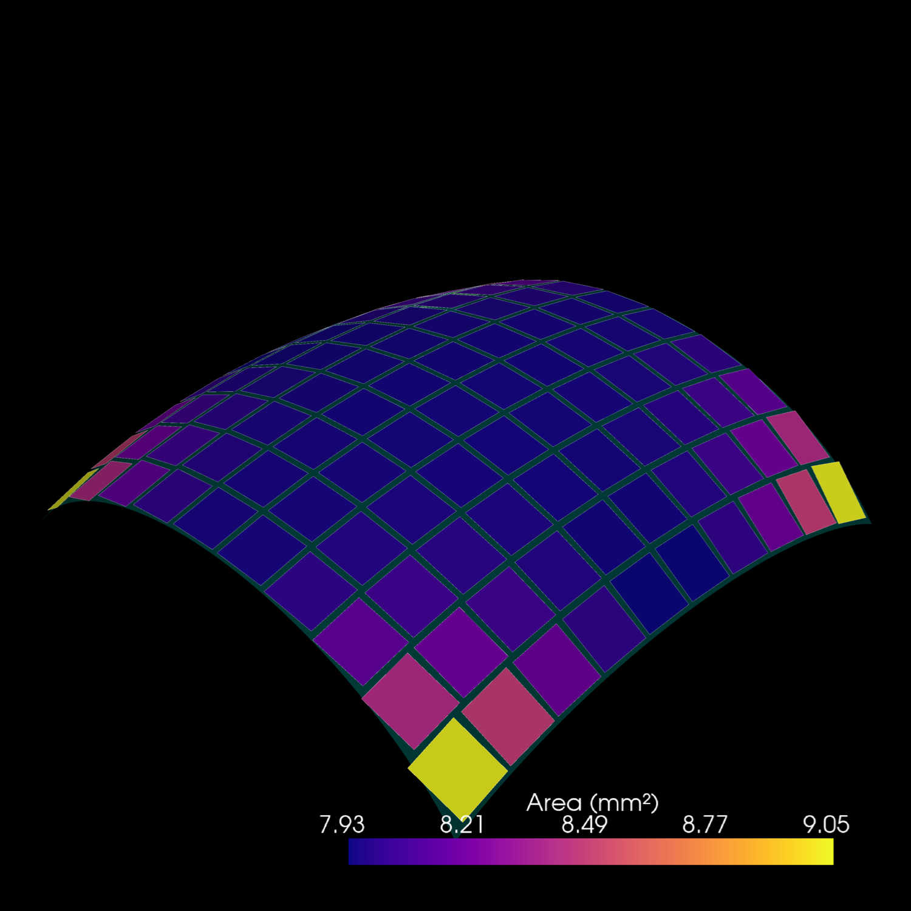
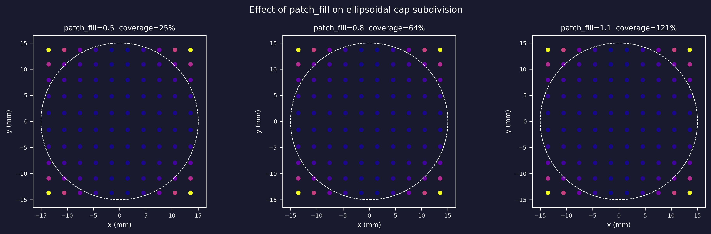

# Example 10: Parametric Surface Subdivision in rectangular patches (for transducers)

Demonstrates `subdivide_parametric_surface`, the public utility that tiles any
C1 parametric surface with flat tangent-plane rectangles for use creation of custom
transducers.

The example uses an **ellipsoidal cap** — a surface with strong curvature
variation from centre to rim — to show how the arc-length adapted grid keeps
patch centres equidistant across the aperture, and how `patch_fill` and
`max_patch_scale` control coverage and space between patches to approximate the
parametric surface.

Note: As an usage example, this function is used for creation of circular curved
monoelement transducers.

[Source on GitHub](https://github.com/EstebanRivera08/PyField/blob/main/examples/example10_subdivide_parametric_surface.py)

---

## Step 1 — Define the surface

```python
import numpy as np
from pyfield.utilities.surface_subdivision import subdivide_parametric_surface

# Ellipsoidal cap: z(x, y) = c * sqrt(1 - x²/a² - y²/b²)
a, b, c = 30e-3, 20e-3, 15e-3   # semi-axes in metres
R_ap = 15e-3                      # aperture radius (circular mask)

def ellipsoid_cap(x, y):
    arg = max(1.0 - (x / a) ** 2 - (y / b) ** 2, 0.0)
    return np.array([x, y, c * np.sqrt(arg)])
```

Any `(u, v) → ndarray(3,)` function works here — no analytic derivatives
required.

---

## Step 2 — Subdivide

```python
frames = subdivide_parametric_surface(
    ellipsoid_cap,
    u_range=(-R_ap, R_ap),
    v_range=(-R_ap, R_ap),
    n_u=10, n_v=10,
    inside_fn=lambda x, y: x ** 2 / a ** 2 + y ** 2 / b ** 2 <= 1.0,
    normal_sign=1.0,
    patch_fill=0.9,
    max_patch_scale=1.5,
)
```

This cap triggers **high-curvature mode** (arc-length amplification > 1.1
near the rim).  `patch_fill=0.9` shrinks each patch to 90% the arc-length
cell in each direction, preventing physical intersection of adjacent flat
patches.  `max_patch_scale=1.5` rejects the steepest rim cells.

---

## Step 3 — Inspect the output

```python
# frames is a dict with keys:
#   'corners'    — list of (4,3) arrays, one per patch (corner vertices in metres)
#   'centers'    — (M,3) patch centres on the surface
#   'normals'    — (M,3) unit outward normals
#   'tangents_u' — (M,3) first tangent axis
#   'tangents_v' — (M,3) second tangent axis (orthogonal to normal and tu)
#   'wu', 'wv'   — (M,) half-widths of each patch (metres)
#   'el_idx'     — (M,) element index per patch (all 0 for single-element)
#   'coverage'   — fraction of theoretical surface area covered by patches
#   'n_rejected' — number of patches rejected due to max_patch_scale

print(f"Patches accepted: {frames['centers'].shape[0]}")
print(f"Patches rejected: {frames['n_rejected']}")
print(f"Coverage        : {frames['coverage']:.1%}")
```

---

## Step 4 — Matplotlib: 3-D mosaic + top-down area map

The left panel shows each flat rectangular patch in its local tangent plane,
coloured by area.  Outward normals are drawn as red arrows.  The right panel
is a top-down scatter plot showing how the arc-length adapted grid distributes
patch centres uniformly across a circular aperture.



---

## Step 5 — PyVista: theoretical surface vs flat patch mosaic

The flat patch mosaic (coloured by area) with the theoretical
surface as a semi-transparent cyan overlay.  The slight mismatch between
patches and surface near the rim is why the coverage metric can exceed 100 %:
flat tangent-plane patches lift slightly above the curved surface and their
areas sum to more than the actual curved area.



---

## Step 6 — Effect of `patch_fill`

Running the same subdivision at `patch_fill` = 0.5, 0.75, and 1.0 shows the
trade-off between coverage and physical patch intersection:

| `patch_fill` | Coverage | Risk |
|---|---|---|
| `0.5` | ~25 % | Safe — no intersection even on coarse grids |
| `0.75` | ~56 % | Good balance for moderate curvature |
| `1.0` | ~100 % | Safe on low-curvature surfaces |



See [Choosing `patch_fill`](../api/transducers.md#choosing-patch_fill) in the
API reference for the full discussion.
