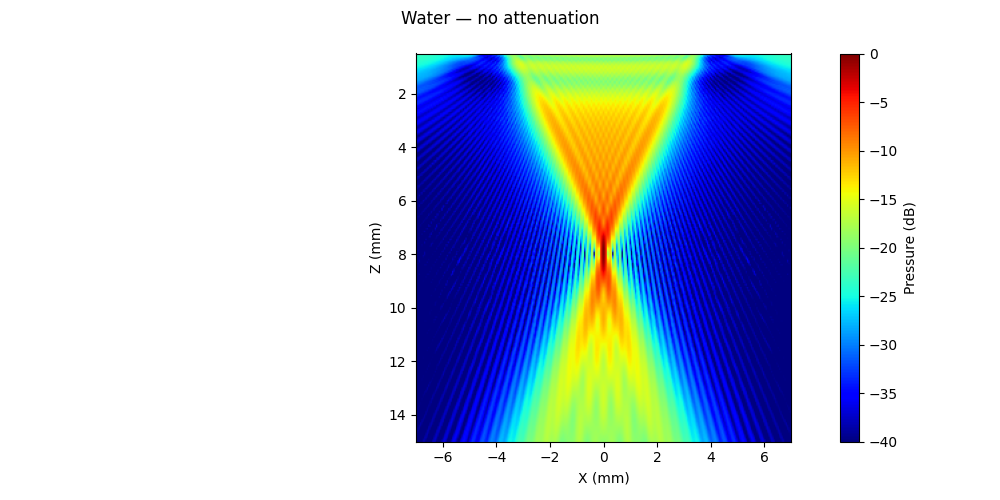
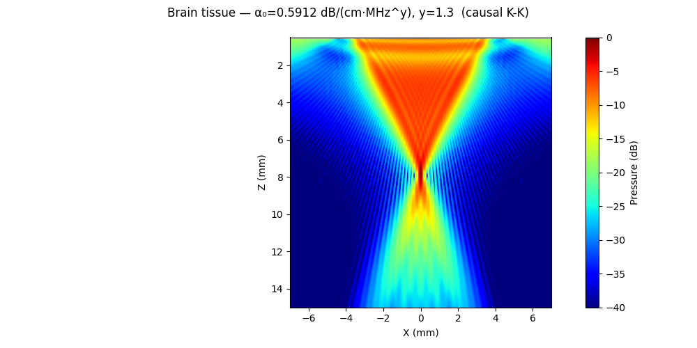
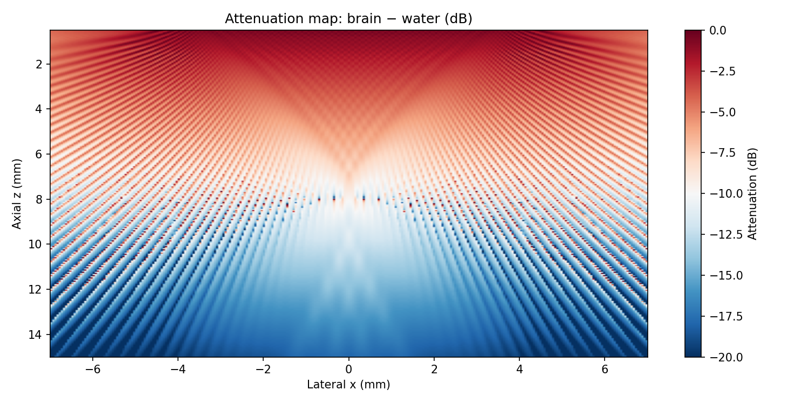

# Example 11: CW Pressure Field with Tissue Attenuation

Side-by-side CW fields of a 10 MHz linear array in water (lossless) and in
brain tissue (causal power-law attenuation with Kramers–Kronig dispersion,
α₀ = 0.59 dB/(cm·MHz^y), y = 1.3 — ITIS database values).

## What you will learn

- Enabling causal attenuation: `Emission(alpha0=..., freq_power=...)`
- How attenuation reshapes a high-frequency focused beam
- Building a dB attenuation map from the two fields

## Output





## Run it

```bash
uv run examples/example11_lineararray_attenuations_monochromatic_CW.py
```

## Key code

```python
from pyfield.emission import Emission

sim_water = Emission(tx, monochromatic=True, fs=100e6)
p_water, coords = sim_water(plane)

sim_brain = Emission(tx, monochromatic=True, fs=100e6,
                     alpha0=0.5912, freq_power=1.3)
p_brain, coords = sim_brain(plane)

att_map_db = 20 * np.log10(p_brain / p_water)
```

[View full script on GitHub](https://github.com/EstebanRivera08/PyField/blob/main/examples/example11_lineararray_attenuations_monochromatic_CW.py)
