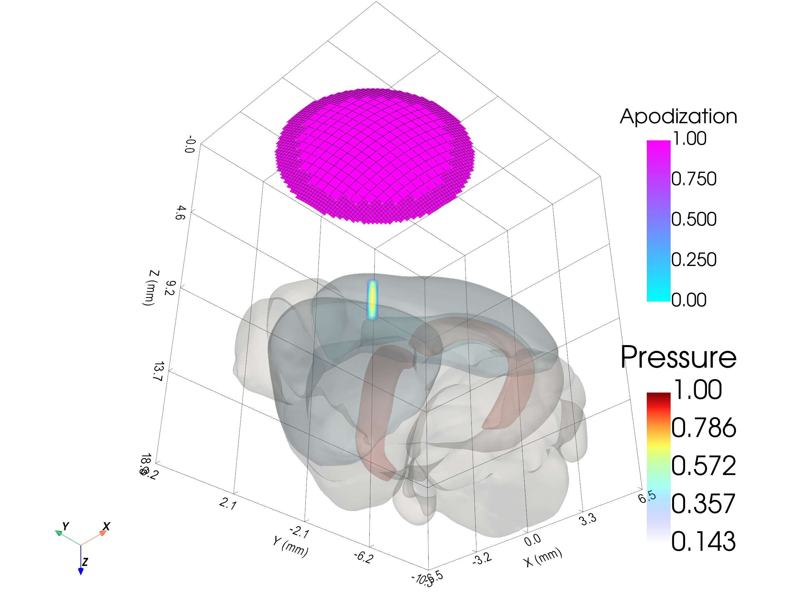

# Example 12: Mouse Brain Atlas with Focused Ultrasound

Combines a BrainGlobe mouse brain atlas (`allen_mouse_25um`) with a concave
bowl transducer and its simulated pressure field in a single 3-D scene.

## What you will learn

- Loading a BrainGlobe atlas and selecting brain regions
- Simulating a small focal volume with a concave bowl transducer
- Building a 4x4 affine transform to register the atlas to the transducer frame
- Rendering anatomy, transducer, and pressure together in PyVista

## Prerequisites

This example requires the BrainGlobe atlas API.  The mouse atlas data
(~500 MB) is downloaded automatically on first run.

## Output



## Run it

```bash
uv run examples/example12_txconcave_mousebrain.py
```

## Key code

```python
from pyfield.utilities import BG_Atlas
from pyfield.transducers import ConcaveCircularTransducer

mouse_tx = ConcaveCircularTransducer(
    diameter_mm=10.0,
    focus_mm=10.0,
    no_sub_diameter=20,
    frequency_Hz=5e6,
)

mouse_atlas = BG_Atlas("allen_mouse_25um", region_names=("root", "Isocortex", "CA1"))
mouse_atlas.transform(T_matrix=T_matrix, inplace=True)
```

[View full script on GitHub](https://github.com/EstebanRivera08/PyField/blob/main/examples/example12_txconcave_mousebrain.py)
