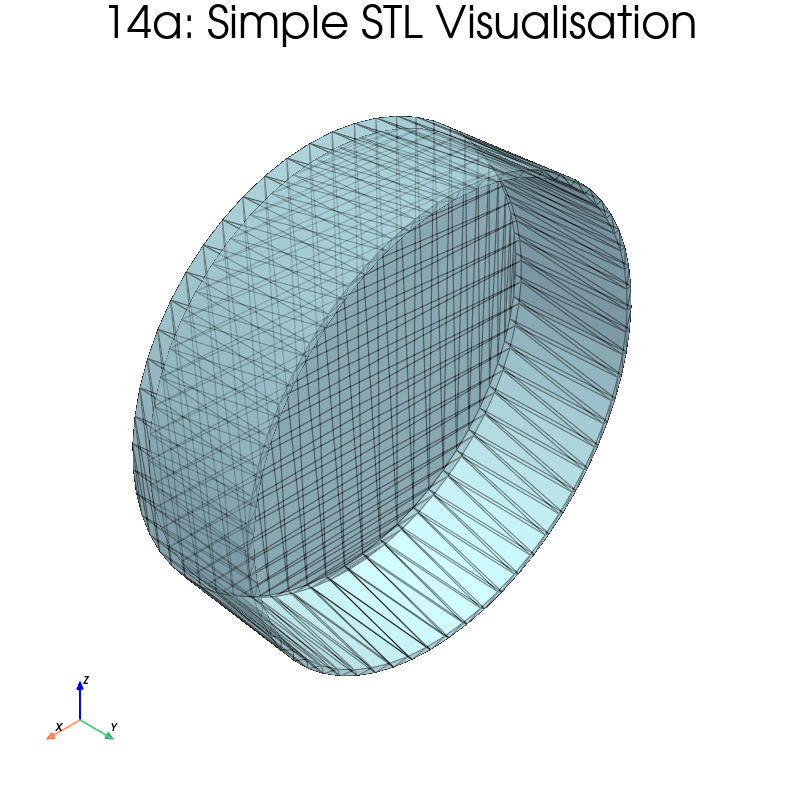
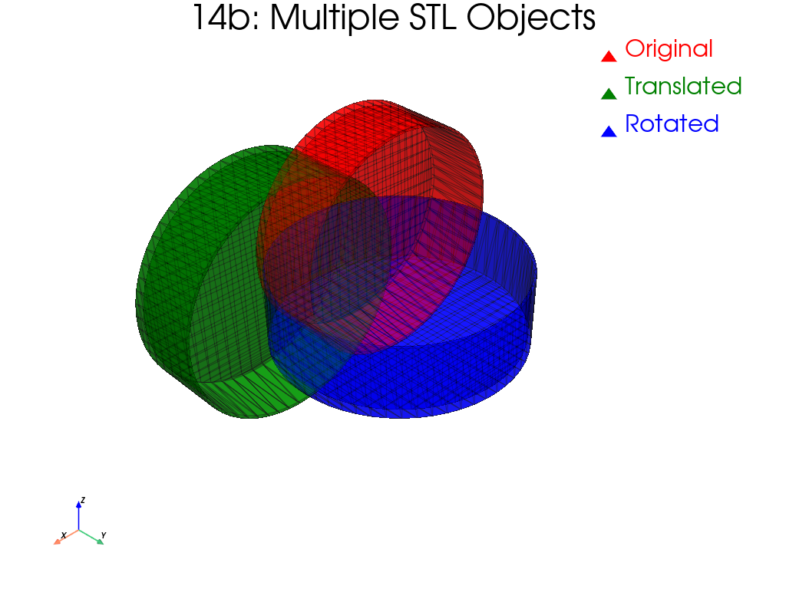
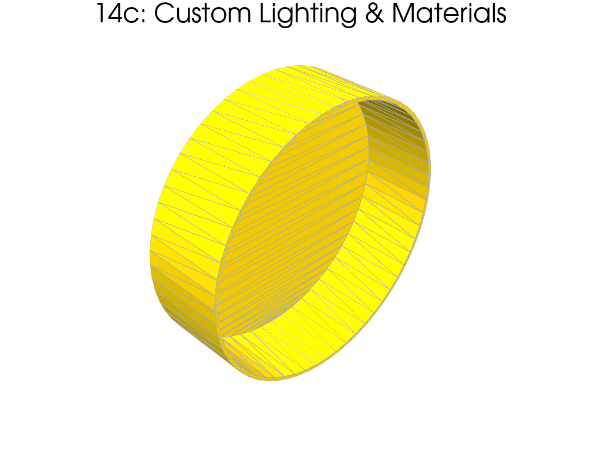

# Example 14: STL Mesh Loading and Visualisation

Shows how to load and visualise STL files (experimental setup components)
using `load_mesh_from_stl` and `add_stl_mesh`.  Five sub-examples cover
progressively more advanced operations.

## What you will learn

- Loading STL files into PyVista meshes
- Applying geometric transforms (scale, translation, rotation)
- Combining multiple STL objects in one scene
- Inspecting mesh properties (bounds, volume, surface area)
- Customising rendering with lighting and materials

## Sub-examples

| Step | Description |
|------|-------------|
| 8a | Simple STL visualisation |
| 8b | Transformations (scale 2x, translate, rotate 45 deg) |
| 8c | Multiple STL objects in one scene |
| 8d | Mesh analysis + solid vs wireframe rendering |
| 8e | Custom lighting and material properties |

## Prerequisites

Place the `Petri_dish.stl` file in the `examples/` folder.

## Output





## Run it

```bash
uv run examples/example14_importstl_petri_dish.py
```

## Key code

```python
from esdiva.plotting import load_mesh_from_stl, add_stl_mesh

mesh = load_mesh_from_stl("Petri_dish.stl", scale=2.0, translation=(10, 5, 0))
plotter = add_stl_mesh(mesh, color="coral", opacity=0.9)
plotter.show()
```

[View full script on GitHub](https://github.com/EstebanRivera08/eSDIva/blob/main/examples/example14_importstl_petri_dish.py)
