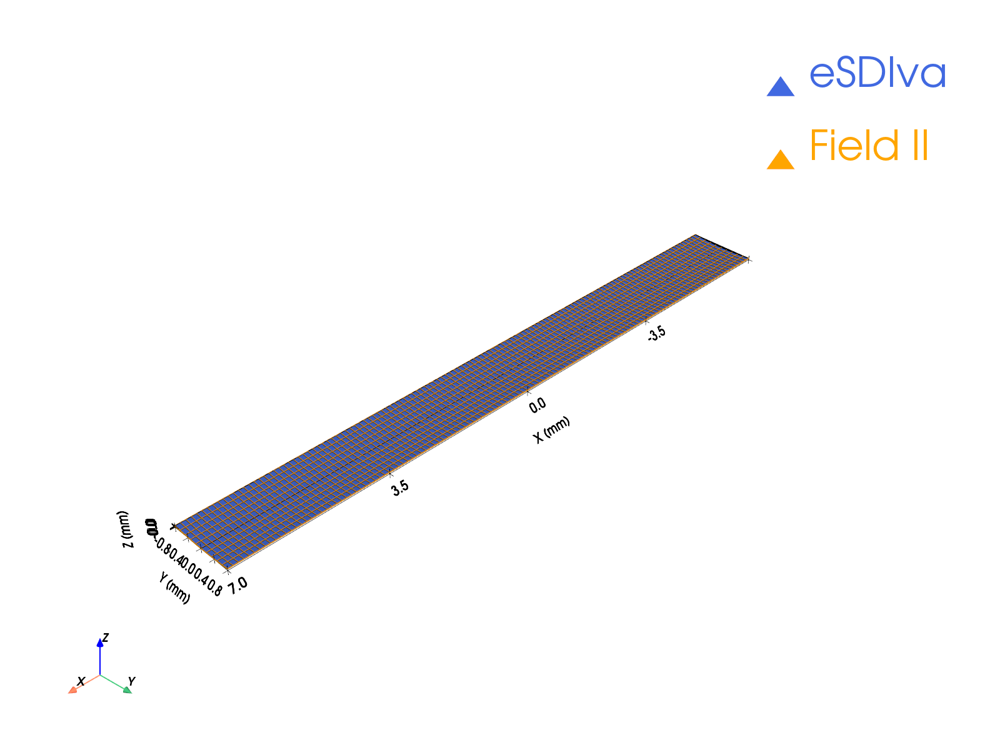
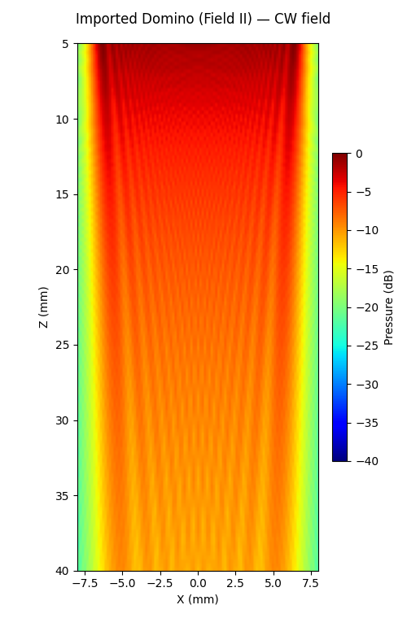

# Example 17: Import a Field II Transducer

Turns a probe exported from MATLAB Field II (`xdc_get(Th, 'rect')`) into a
native SonDI transducer. Per-element apodization and delays from the
export are preserved exactly; the imported aperture can then be focused,
visualised, and used in any `Emission` / `Reception` simulation.

## What you will learn

- The one-line MATLAB export: `geom = xdc_get(Th, 'rect')`
- Inspecting `.mat` files with `sondi.utilities.explore_mat`
- `from_fieldii_rect_data` → `FieldIITransducer`
- Electronic focusing and CW simulation of the imported probe

## Output




## Run it

```bash
uv run examples/example17_import_fieldii_transducer.py
```

## Key code

```python
import scipy.io
from sondi.emission import Emission
from sondi.transducers import from_fieldii_rect_data
from sondi.utilities import explore_mat

data = scipy.io.loadmat("linear_psf_fieldii.mat", simplify_cells=True)
explore_mat(data)                       # inspect the exported structure

tx = from_fieldii_rect_data(data["geom"], frequency_hz=float(data["f0"]))
tx.compute_delays(focus_mm=[0, 0, 60])  # behaves like any SonDI transducer

sim = Emission(tx, monochromatic=True)
p, coords = sim(plane, method="auto")
```

!!! note "Lensed probes"
    For elevation-lensed probes (`xdc_focused_array`), pass
    `elevation_focus_mm=Rfocus_mm` to the import so the reception time origin
    includes the lens transit.

[View full script on GitHub](https://github.com/EstebanRivera08/SonDI/blob/main/examples/example17_import_fieldii_transducer.py)
