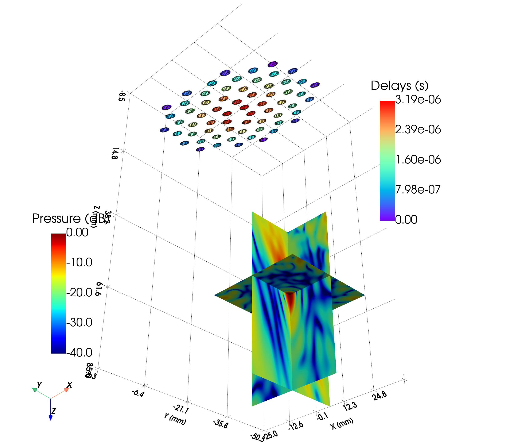

# Example 18: Custom Sparse Array — transform() and 3-D Plane Slices

Assembles a 64-element sparse spiral array with `CustomTransducer`, mounts
it tilted over the target with `transform()`, refocuses electronically, and
visualises the field on three orthogonal planes in 3-D — the pattern to use
when the volume of interest is too large to sample fully.

## What you will learn

- `CustomTransducer` from one mono-element template + position list
- Rigid repositioning with `transform(T_matrix)` (rotation + translation in mm)
- Why delays must be recomputed after a move, and why the simulator needs
  `sim.set("transducer", tx)` to see the new pose
- Plane-slice 3-D visualisation: `create_2Dimage_mesh` + `add_2D_image`

## Output



## Run it

```bash
uv run examples/example18_customtransducer_3Dplanes.py
```

## Key code

```python
from esdiva.transducers import CustomTransducer, FlatCircularTransducer
from esdiva.emission import Emission
from esdiva.plotting import add_2D_image, add_transducer_mesh, create_2Dimage_mesh

disc = FlatCircularTransducer(diameter_mm=3.0, no_sub_diameter=6, frequency_Hz=1e6)
tx = CustomTransducer(elements=[disc] * 64, positions_mm=spiral_positions_mm,
                      frequency_Hz=1e6)

sim = Emission(tx, monochromatic=True)

tx.transform(T_tilt_and_shift)          # rigid move (4×4, translation in mm)
tx.compute_delays(focus_mm=target_mm)   # refocus from the new pose
sim.set("transducer", tx)               # refresh the simulator's snapshot

p_xz, c_xz = sim(plane_xz)              # one call per orthogonal plane

mesh = create_2Dimage_mesh(p_db, extent=(x0, x1, z0, z1), plane_offset={"y": 0})
plotter = add_2D_image(mesh, cmap="jet", clim=[-40, 0])
plotter = add_transducer_mesh(tx.get_mesh(), plotter=plotter, scalars="Delays")
```

[View full script on GitHub](https://github.com/EstebanRivera08/eSDIva/blob/main/examples/example18_customtransducer_3Dplanes.py)
