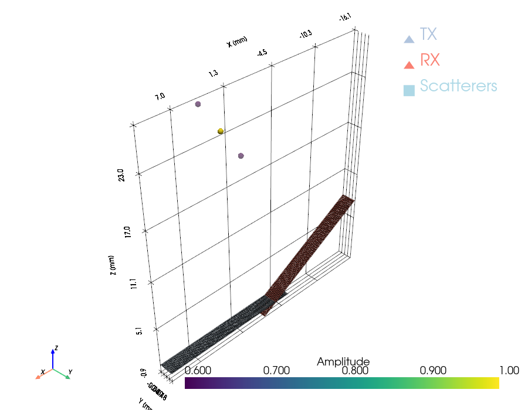
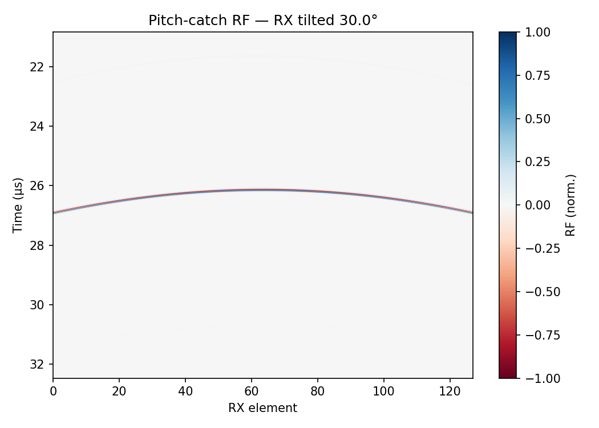

# Example 19: Dual-Probe Pulse-Echo — Moved TX/RX and show()

Pitch-catch configuration: one linear array transmits a focused beam and a
second identical array, tilted 30° with `transform()`, receives from an
oblique angle — the geometry behind vector Doppler and multi-perspective
imaging research.

## What you will learn

- Rotating an aperture *about the target point* with a single 4×4 transform
- `sim.show(scatterers, amplitudes)` — 3-D preview of both apertures
- Pulse-echo RF between two different apertures (`ReceptionSDI(tx, rx)`)

## Output




## Run it

```bash
uv run examples/example19_dualprobe_reception_show.py
```

## Key code

```python
import numpy as np
import pyfield.transducers as transducers
from pyfield.reception import ReceptionSDI

tx = transducers.Domino()
tx.compute_delays(focus_mm=[0, 0, 20])

rx = transducers.Domino()
th = np.deg2rad(30)
R = np.array([[np.cos(th), 0, np.sin(th)], [0, 1, 0], [-np.sin(th), 0, np.cos(th)]])
T = np.eye(4)
T[:3, :3] = R
T[:3, 3] = target_mm - R @ target_mm    # rotate about the target, not the origin
rx.transform(T)

sim = ReceptionSDI(tx, rx, c=1540, fs=200e6, excitation=excitation)
sim.show(scatterer_pos, scatterer_amp)  # 3-D preview
rf, coords = sim(scatterer_pos, scatterer_amp)
```

[View full script on GitHub](https://github.com/EstebanRivera08/PyField/blob/main/examples/example19_dualprobe_reception_show.py)
