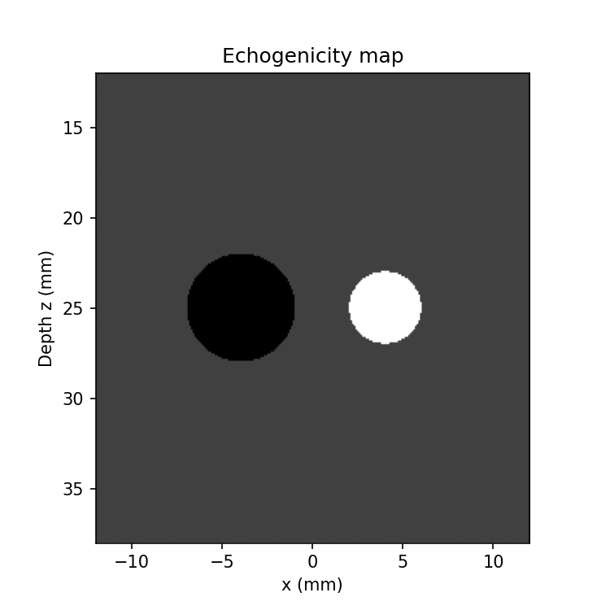
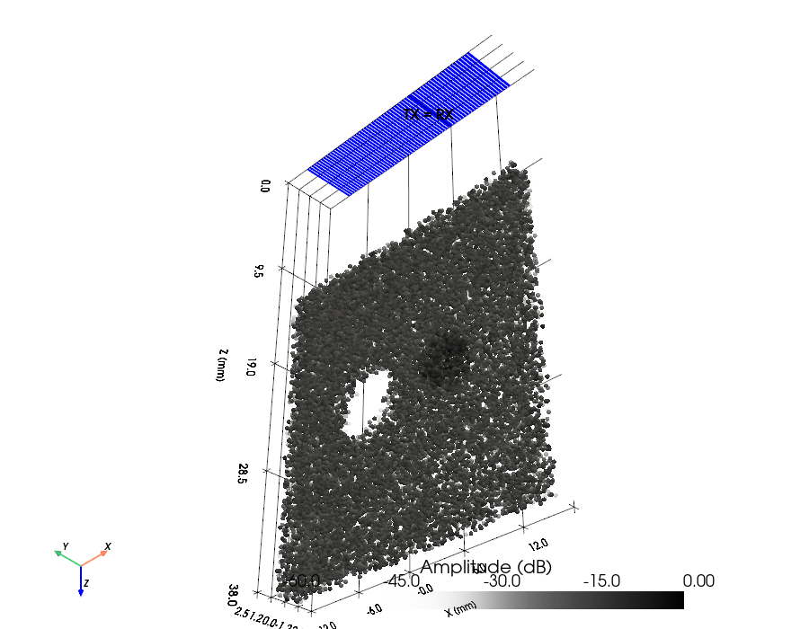
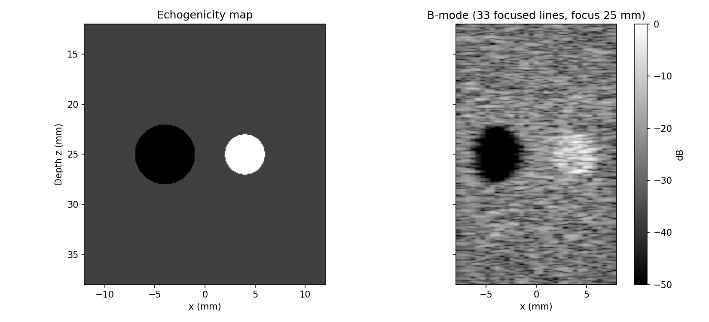

# Example 20: Speckle Phantom — make_phantom() + Focused B-mode

Simulating tissue in pulse-echo means simulating **speckle**: many
sub-wavelength scatterers at random positions whose echoes interfere.
`make_phantom` builds such a cloud from an echogenicity image — here the
classic cyst phantom (anechoic cyst + hyperechoic lesion in a speckle
background), imaged line-by-line with `scan_focusline`.

## What you will learn

- `make_phantom(extents_mm, n, echogenicity_map)` — random positions +
  `N(0,1)·map(r)` amplitudes (a regular grid would return coherent lattice
  echoes, not speckle)
- Scatterer density: fully developed speckle needs ≥ ~5–10 scatterers per
  resolution cell `(λz/D)² · pulse/2`
- Setting the piezo `impulse_response` — without it the elements are ideally
  broadband and the aperture diffraction tails widen the PSF and fill the
  anechoic cyst with sidelobe clutter
- Focused B-mode: one `scan_focusline` call per lateral position, lines
  interpolated onto a common time axis

## Output





## Run it

```bash
uv run examples/example20_phantom_simulation.py
```

## Key code

```python
from esdiva.reception import Reception
from esdiva.utilities import make_phantom

scat_pos, scat_amp = make_phantom(BOX, N_SCATTERERS, echogenicity_map=emap, seed=2026)

tx.impulse_response = excitation.copy()   # piezo band-pass, applied TX and RX
sim = Reception(tx, tx, c=C, fs=FS, excitation=excitation)
sim.show(scat_pos, scat_amp, TX_color="blue")   # preview before the long run

for xl in LINE_X:                          # one focused line per lateral position
    env, coords = sim.scan_focusline([xl, 0.0, FOCUS_Z], scat_pos, scat_amp,
                                     FoverD=2.0, apodization_type="hanning")
```

[View full script on GitHub](https://github.com/EstebanRivera08/eSDIva/blob/main/examples/example20_phantom_simulation.py)
