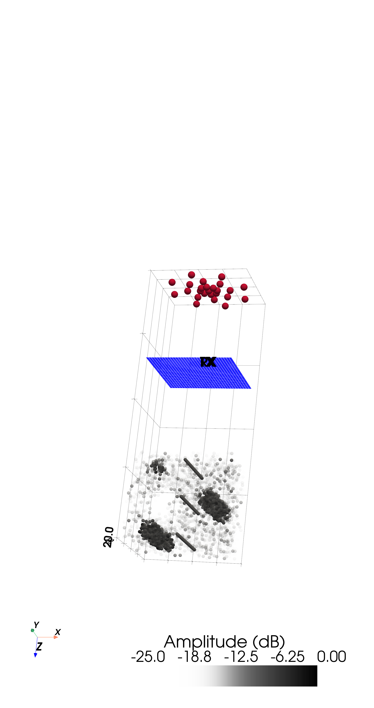
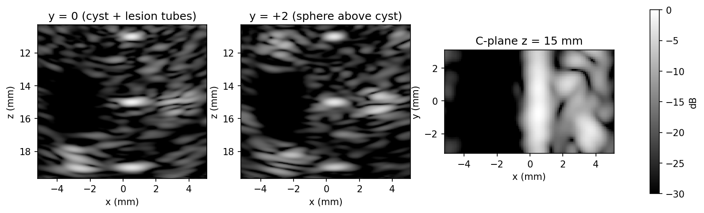
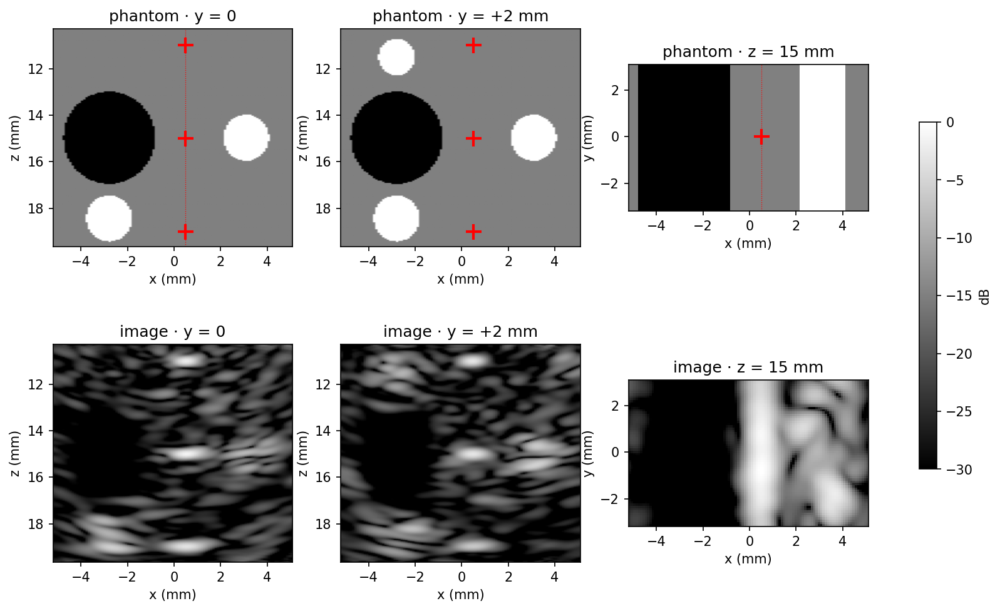
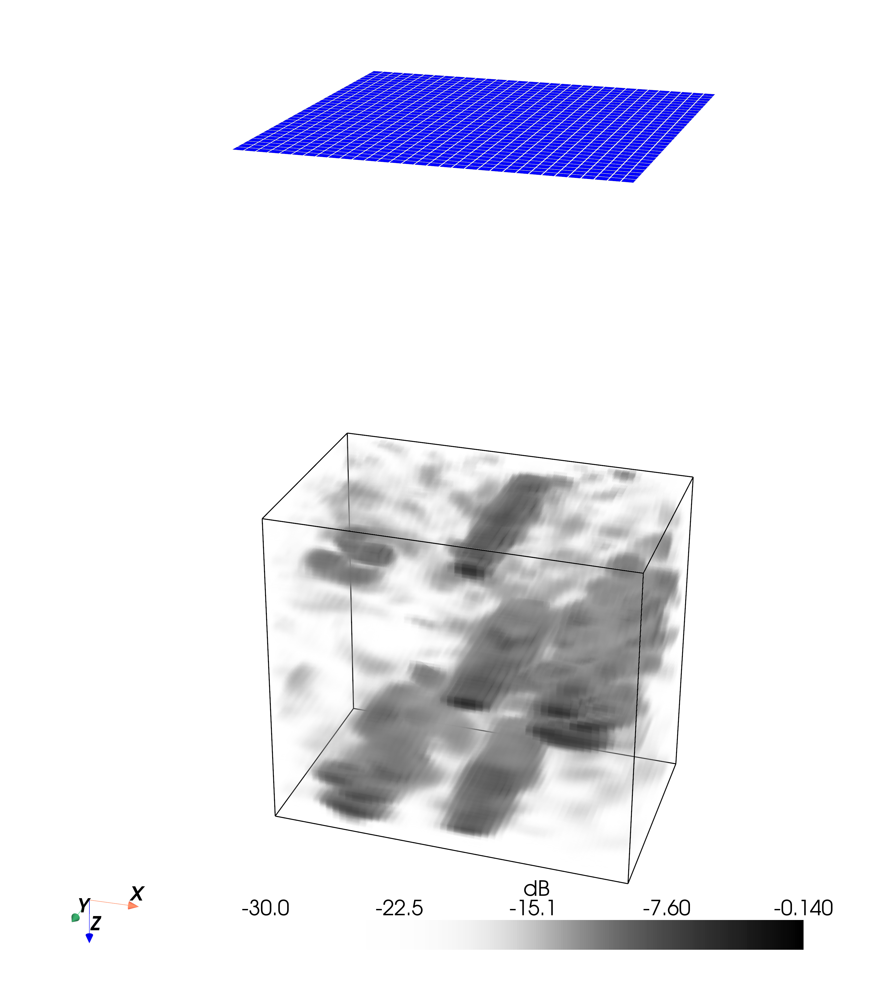

# Example 21: Volumetric Imaging Case Study — Matrix Probe, DW Sequence

A complete, checkpointed volumetric imaging pipeline in three steps: a shared
contrast-ladder phantom (anechoic cyst, ×4 lesions, elevation sphere, PSF
wires + bead column), a diverging-wave transmit sequence derived per probe
from the coverage rule, crash-safe RF acquisition, and per-event 3-D
delay-and-sum with coherent IQ compounding. Three probe scenarios share one
phantom; the default `vermon` (32×32, 3 MHz) runs the full pipeline in
minutes.

## The pipeline

| Script | What it does |
|--------|--------------|
| `step1_define_phantom_TX_RX.py` | All definitions in one place: scenario (probe + drive), phantom, virtual-source sequence, drive burst + piezo impulse response, beamforming grid |
| `step2_acquire_RF.py` | `ReceptionSDI(method="spectral")`, one TX event at a time, checkpointed to `out/<scenario>/RF/` (resumable, refuses a changed config) |
| `step3_beamforming.py` | Per-event `das_volume` → Hilbert IQ → coherent compound → depth-only TGC → contrast/SNR/PSF metrics + B-mode figures |

Supporting scripts: `preview_phantom.py` (truth + acquisition scene BEFORE the
long run) and `visualize_beamformed_volume.py` (3-D renders from the saved IQ
volume — never re-beamforms).

## Output (vermon scenario)







## Run it

```bash
uv run examples/example21_rca_volume/step2_acquire_RF.py
uv run examples/example21_rca_volume/step3_beamforming.py
# pick another probe: SCENARIO=zeus5 (or zeus10) before the commands
```

## Where the lessons live

Every design rule this case study cost us — impulse responses, virtual-source
coverage, phantom density, wire brightness, honest metrics — is distilled in
the example folder's
[`README.md`](https://github.com/EstebanRivera08/PyField/blob/main/examples/example21_rca_volume/README.md)
and
[`TROUBLESHOOTING.md`](https://github.com/EstebanRivera08/PyField/blob/main/examples/example21_rca_volume/TROUBLESHOOTING.md).
