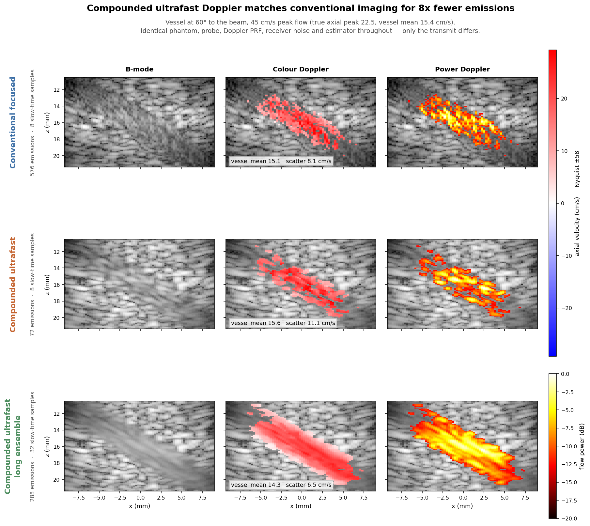
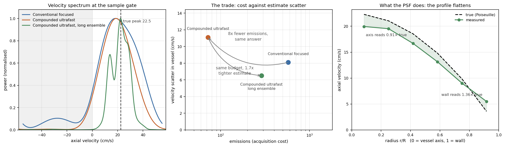

# Example 22: Ultrafast Compound Doppler

A controlled replication of **ultrafast compound Doppler imaging** — Bercoff,
Montaldo, Loupas, Savery, Mézière, Fink & Tanter, *IEEE Trans. Ultrason.
Ferroelectr. Freq. Control* **58**(1):134–147, 2011 — run on a phantom whose true
velocity we set ourselves, which the original experiment could not have.

**The claim:** a colour-flow image built from a handful of tilted plane waves,
coherently summed, gives the same Doppler performance as conventional
line-by-line focused Doppler for **8× fewer emissions** here. One
phantom, one probe, one pulse, one Doppler PRF, one estimator, one noise level —
only the transmit differs.

| Sequence | Transmit | Emissions | Slow-time samples |
|---|---|---|---|
| Conventional focused | 72 focused lines, one packet each | 576 | 8 |
| Compounded ultrafast | 9 tilted plane waves per frame | 72 | 8 |
| …long ensemble | 9 tilted plane waves per frame | 288 | 32 |

## What you will learn

- **Moving scatterers** — `scatterer_positions_mm` as `(N_emissions, N_scat, 3)`,
  one cloud per emission; eSDIva has no slow-time clock, so you write the
  trajectory
- **The design rule** `N_angles = PRF_max/PRF_doppler`, and how the depth limit
  `PRF_max = c/(2·z_max)` makes every extra angle cost velocity range
- **Why compounding happens within a frame and never across frames** — summing
  across frames averages away the phase that carries the flow
- **Designing the elevation aperture** — the axis the image cannot show, and the
  one that decides whether a velocity number is trustworthy
- **Sizing a phantom by scatterers per *resolution cell***, not by total count

## Output




Each row is one sequence: the B-mode it reconstructed, its colour Doppler map on
a shared velocity scale, and its power Doppler.

### The flow, frame by frame

<video controls muted loop playsinline preload="metadata" style="width:100%;max-width:560px;display:block;margin:0 auto">
  <source src="../assets/ex22_video1_flow.mp4" type="video/mp4">
</video>

Blood is barely visible on the B-mode — that is the point, and why Doppler
exists. The colour overlay comes from the same frames, and the velocity profile
across the tube is read from the map, not from the phantom's definition.

### What the transmit costs

<video controls muted loop playsinline preload="metadata" style="width:100%;max-width:560px;display:block;margin:0 auto">
  <source src="../assets/ex22_video2_sequences.mp4" type="video/mp4">
</video>

Both panels are real beamformed output. The conventional scan builds its image
one focused line at a time; the ultrafast one shows each tilted plane wave and
their coherent sum, at nine emissions per frame against 72 lines.

Rebuild both with `uv run examples/example22_flow_doppler/make_videos.py` once
step 2's RF is on disk.

## Run it

```bash
uv run examples/example22_flow_doppler/step1_define_flow_phantom.py   # preview
uv run examples/example22_flow_doppler/step2_acquire_RF.py            # the long one
uv run examples/example22_flow_doppler/step3_doppler_processing.py
uv run examples/example22_flow_doppler/step4_visualize.py
```

Step 3 asserts both of the paper's claims, so the example fails loudly if the
simulator, the beamformer or the estimator regresses.

!!! warning "Estimate the runtime on your own machine first"
    Step 2 calls `esdiva.utilities.estimate_sequence_runtime`, which times short
    probes on the real phantom and projects. Cost per emission is a property of
    the hardware and varies by more than an order of magnitude between a laptop
    and a compute node. Every run is checkpointed, so a killed job resumes.

## Key code

```python
# Events are just transmit delays. Copy them - probe.delays is live state.
frame = []
for angle in ANGLES_DEG:
    probe.compute_delays(angle_steering_deg=float(angle))
    frame.append({"delays": np.asarray(probe.delays, np.float32).copy(),
                  "apodization": np.ones(N_ELEMENTS, np.float32),
                  "angles_deg": float(angle)})
events = frame * ensemble          # the SAME angles every frame

# One scatterer cloud per emission - this is what makes flow possible.
positions = np.stack([np.vstack([tissue, blood_at(m)])
                      for m in range(n_emissions)])       # (N_em, N_scat, 3)
rf, coords = sim.sequence_rf(positions, amplitudes, events, out_path="out/RF_B")

# Compound WITHIN a frame; each frame is one slow-time sample.
for k in range(ensemble):
    sl = slice(k * N_ANGLES, (k + 1) * N_ANGLES)
    vol, gc = das_volume(rf[sl], {...}, frame_events, probe, GRID_MM, c=C)

f_echo = echo_center_frequency(beamformed, 1 / fs_depth, band=(0.3 * FC, 1.7 * FC))
iq = rf2iq(beamformed, fs_depth, f_echo)
v_map, power = iq2doppler(wfilt(iq), PRF_DOPPLER, f_echo, c=C)
```

The Doppler chain (`rf2iq`, `wfilt`, `iq2doppler`) lives in the example, not the
package — eSDIva simulates the RF and beamforms it; turning an ensemble into a
velocity is signal processing. See
[Flow Simulation](../user-guide/flow-simulation.md).

## Two things worth sizing before you run

The folder's own `README.md` carries the measurements and the error budget.

- **Size the phantom by scatterers per resolution cell, and the cell against the
  vessel.** Too few per cell gives a moth-eaten flow map; a cell too large beside
  the lumen flattens the profile. Elevation is the axis that bites, since a linear
  array does not focus there electronically — an
  [elevation lens](../user-guide/multi-elements.md#elevation-lens) is the fix.
- **Add receiver noise before any sensitivity claim.** eSDIva's RF is noiseless by
  design, so a longer ensemble has nothing to average down. Use
  `esdiva.utilities.add_noise` with one shared `reference` across the sequences
  being compared — noise belongs to the receiver, not the transmit scheme.

[View the scripts on GitHub](https://github.com/EstebanRivera08/eSDIva/tree/main/examples/example22_flow_doppler)
