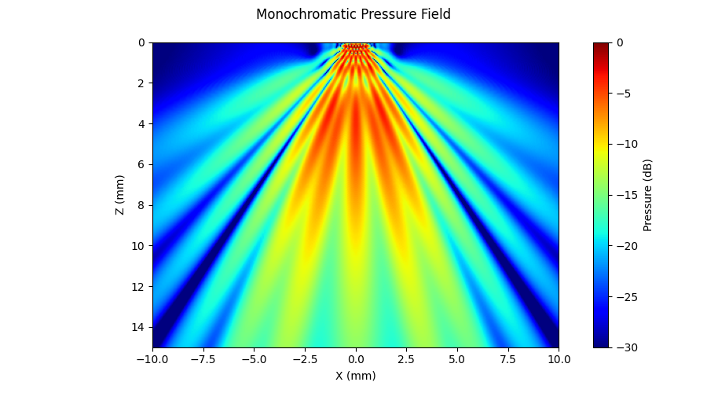

# Example 3: Linear Array — Monochromatic (CW)

Demonstrates continuous-wave simulation with a linear array transducer using
diverging-wave transmission (virtual source behind the array).

## What you will learn

- Using preset transducers (`Domino()`)
- Setting up diverging-wave delays with a negative-z virtual focus
- Computing a 2-D monochromatic pressure field
- Visualising in dB scale with `plot2D_pressure_slices`

## Output



## Run it

```bash
uv run examples/example3_lineartx_monochromatic.py
```

## Key code

```python
import pyfield.transducers as transducers
from pyfield.psimulation import PyField
from pyfield.plotting import plot2D_pressure_slices

tx = transducers.Domino()
tx.compute_delays(focus_mm=[0, 0, -1])       # virtual source → diverging wave
tx.compute_apodization(focus_mm=[0, 0, -1], FoverD=1)

sim = PyField(tx)
p, coords = sim(plane_config)
x, y, z = coords["x"], coords["y"], coords["z"]

plot2D_pressure_slices(p, x=x, y=y, z=z, db_scale=True, vmin=-30)
```

[View full script on GitHub](https://github.com/EstebanRivera08/PyField/blob/main/examples/example3_lineartx_monochromatic.py)
