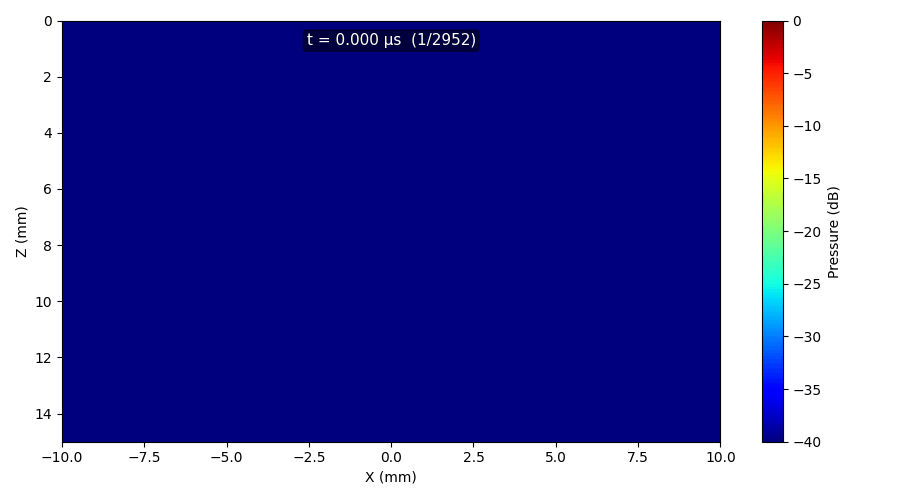

# Example 5: Linear Array — Transient (Pulsed) Simulation

Demonstrates pulsed ultrasound simulation with two emission modes: focused
(default pulse) and steered (user-defined excitation signal).

## What you will learn

- Difference between monochromatic and transient simulation modes
- Defining a Hanning-windowed excitation pulse
- Computing 4-D spatio-temporal pressure fields
- Animating propagating wavefronts with `plot2D_pressure_slices`

## Emission modes

| Mode | Description |
|------|-------------|
| **Focused** (`EMISSION_TYPE=1`) | Pulsed emission without explicit excitation — PyField uses a default pulse |
| **Steered** (`EMISSION_TYPE=2`) | Beam steering with an explicit multi-cycle excitation signal |

## Output



## Run it

```bash
uv run examples/example5_lineartx_transient.py
```

## Key code

```python
from pyfield.psimulation import PyField
import pyfield.transducers as transducers

tx = transducers.Domino()
tx.compute_delays(focus_mm=[0, 0, 8])

sim = PyField(tx)

# Transient (pulsed) simulation — no explicit excitation
p_field, coords = sim(plane_config, monochromatic=False)

# Or with explicit excitation:
# p_field, coords = sim(plane_config, excitation=excitation_signal)
```

[View full script on GitHub](https://github.com/EstebanRivera08/PyField/blob/main/examples/example5_lineartx_transient.py)
