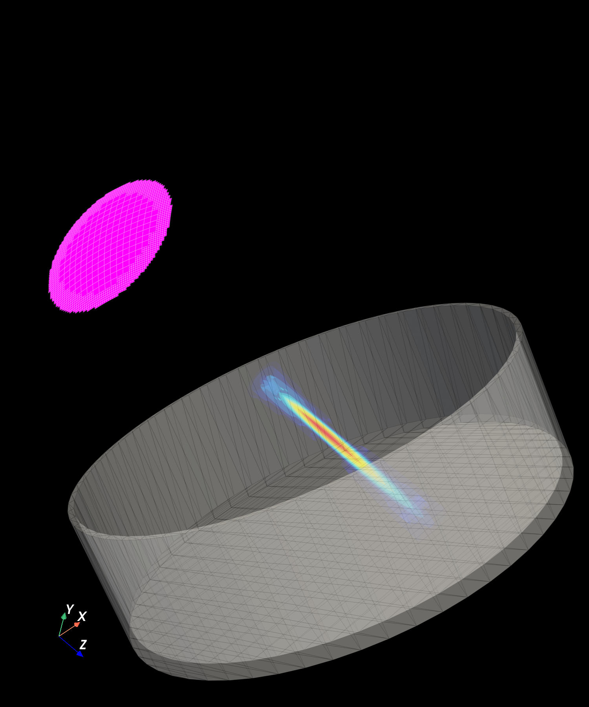

# Example 9: STL Mesh with Acoustic Simulation

Combines an STL model of a petri dish with a PyField acoustic simulation to
visualise the complete experimental configuration in a single 3-D scene.

## What you will learn

- End-to-end workflow: transducer creation, simulation, and STL import
- Positioning experimental geometry (STL) in the simulation coordinate frame
- Composing transducer + pressure + STL in PyVista

## Output



## Run it

```bash
uv run examples/example9_monoelement_petridish.py
```

## Key code

```python
from pyfield.psimulation import PyField
from pyfield.transducers import ConcaveCircularTransducer
from pyfield.plotting import (
    add_pressure_vol, add_stl_mesh, add_transducer_mesh,
    create_3Dvol_mesh, load_mesh_from_stl,
)

transducer = ConcaveCircularTransducer(
    diameter_mm=0.5 * 25.4,
    focus_mm=1 * 25.4,
    no_sub_diameter=20,
    frequency_Hz=5e6,
)

sim = PyField(transducer, verbose=False)
p, coords = sim(field_points, method="auto")

petri_dish = load_mesh_from_stl("Petri_dish.stl", translation=(0, -10, 25))

# Compose scene
plotter = pv.Plotter()
plotter = add_transducer_mesh(tx_mesh, plotter=plotter)
plotter = add_pressure_vol(pressure_vol, plotter=plotter)
plotter = add_stl_mesh(petri_dish, plotter=plotter, color="lightgray", opacity=0.3)
plotter.show()
```

[View full script on GitHub](https://github.com/EstebanRivera08/PyField/blob/main/examples/example9_monoelement_petridish.py)
