# Examples

PyField ships with worked examples that progressively introduce the library's
features — from basic transducer geometry to brain-atlas integration and STL
mesh import.

Every script lives in `examples/` at the repository root and can be run directly:

```bash
uv run examples/exampleN_name.py
```

Output figures are controlled by `examples/config.py`.  Set `FIG_FOLDER` to
choose where images are saved and toggle `SAVE_FIG` to switch between saving
and interactive display.

---

## 1. Transducer Gallery

Meet every transducer type in PyField: linear, convex, matrix arrays and all
four circular mono-element geometries, plus a custom TUS helmet.


[Full example →](example1_transducer_gallery.md) · [Source on GitHub](https://github.com/EstebanRivera08/PyField/blob/main/examples/example1_transducer_gallery.py)

---

## 2. Mono-element Pressure Fields

Monochromatic (CW) pressure field for all four circular transducer types: flat
piston, concave bowl, cylindrical line-focus, and convex dome.

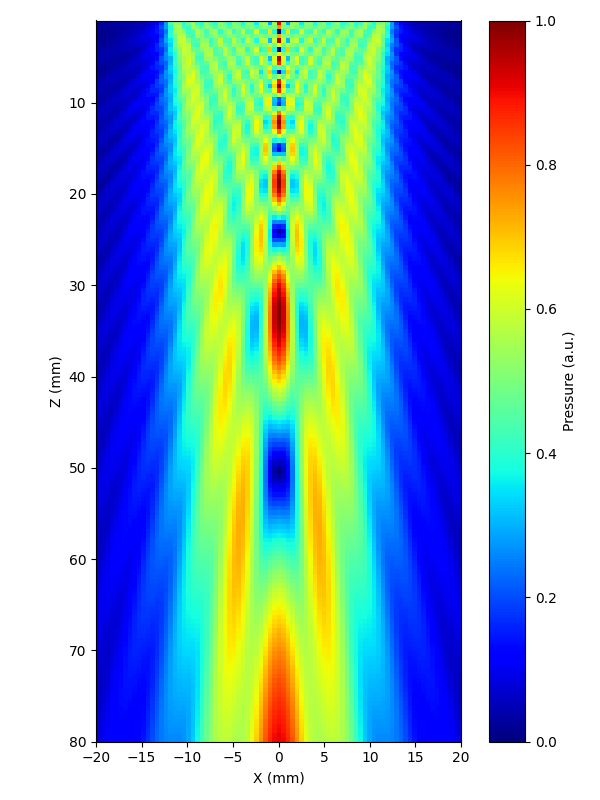
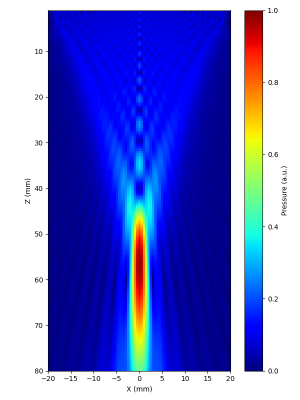
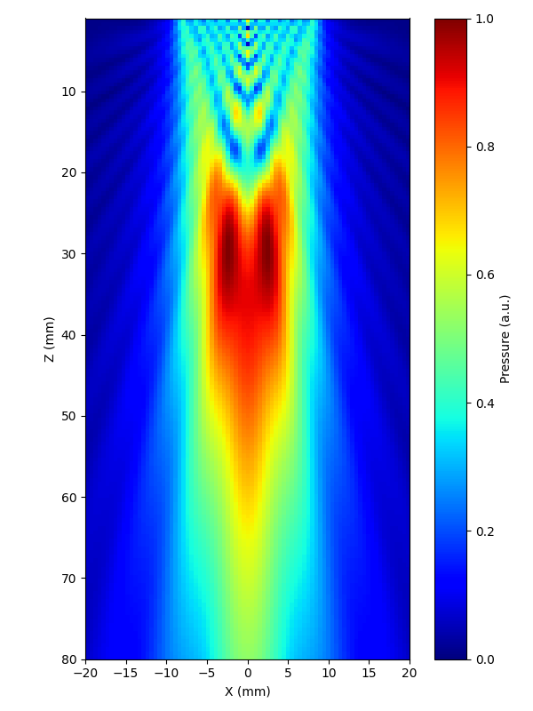
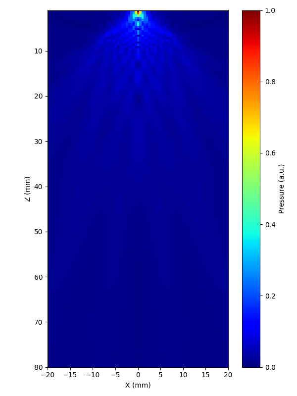

[Full example →](example2_monoelement_transducers.md) · [Source on GitHub](https://github.com/EstebanRivera08/PyField/blob/main/examples/example2_monoelement_transducers.py)

---

## 3. Linear Array — Monochromatic (CW)

Continuous-wave simulation with a Domino linear array using a diverging-wave
(virtual-source) transmit strategy.  Shows the XZ pressure plane in dB scale.


[Full example →](example3_lineartx_monochromatic.md) · [Source on GitHub](https://github.com/EstebanRivera08/PyField/blob/main/examples/example3_lineartx_monochromatic.py)

---

## 4. Multi-element Transducers — 3-D

Focused field for a linear and a matrix array rendered in 3-D with PyVista.
Transducer geometry and pressure volume are composed in the same scene.

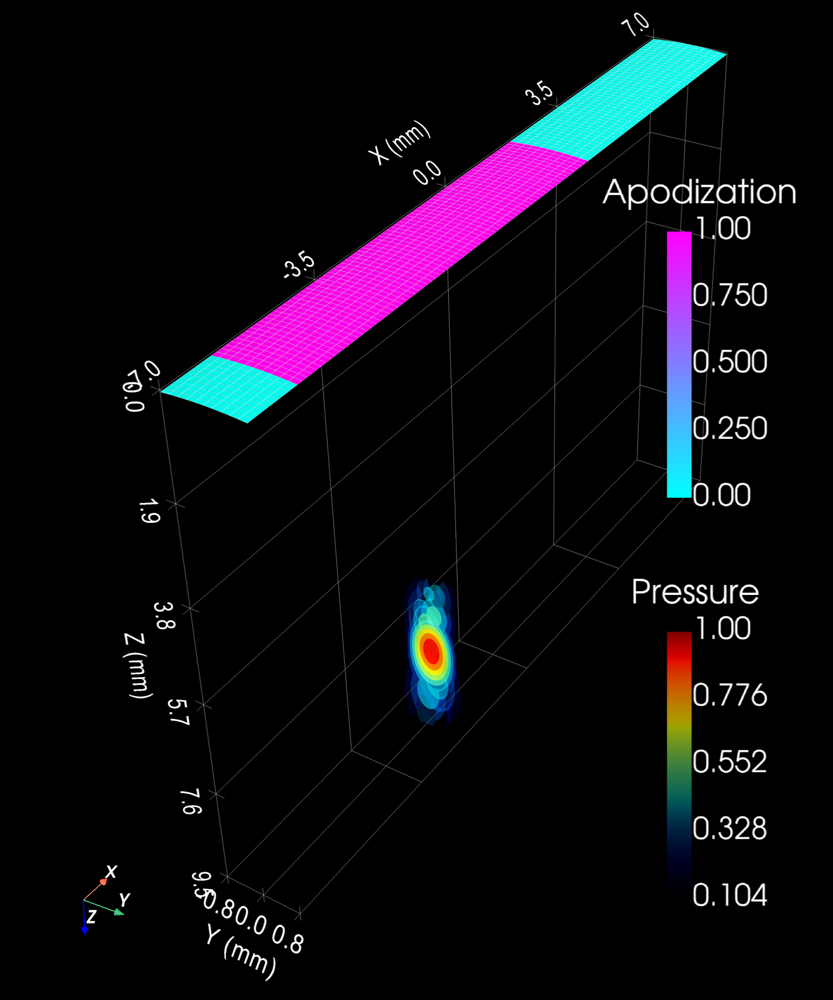
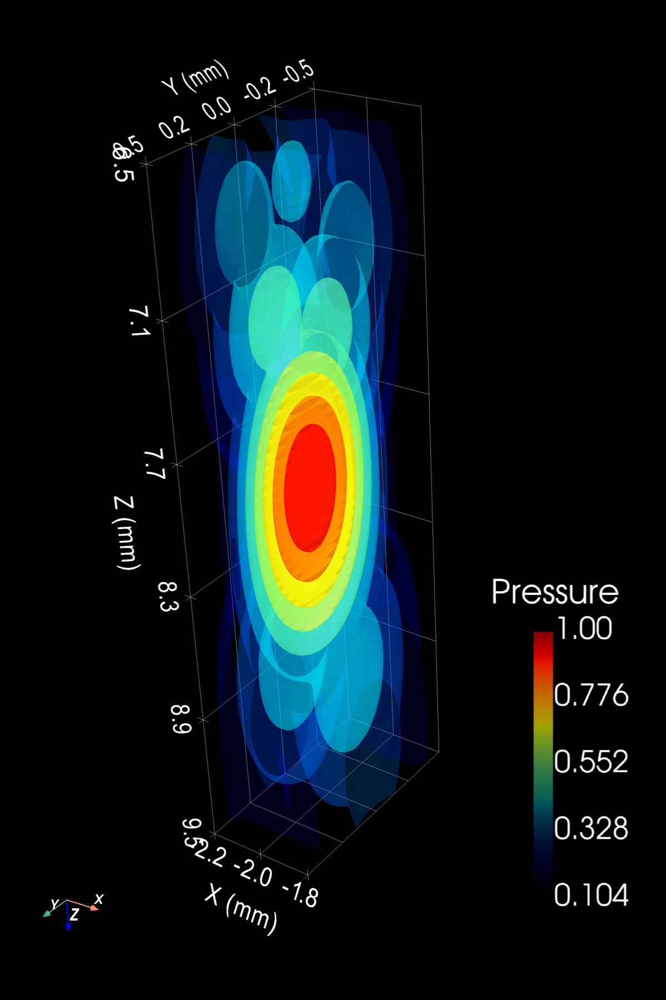
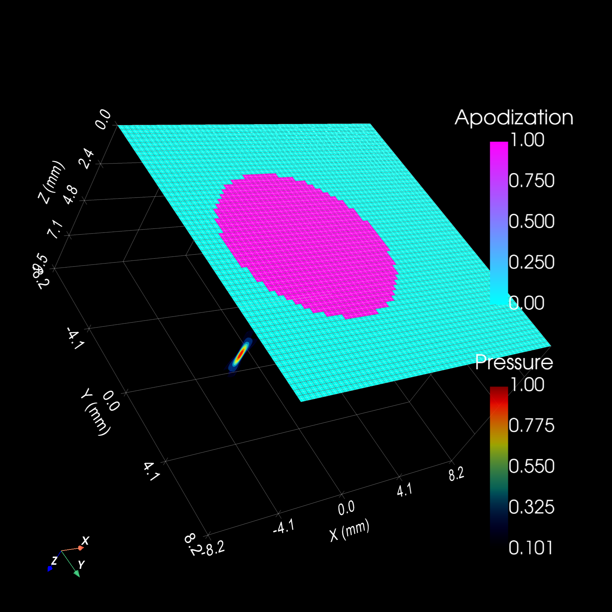
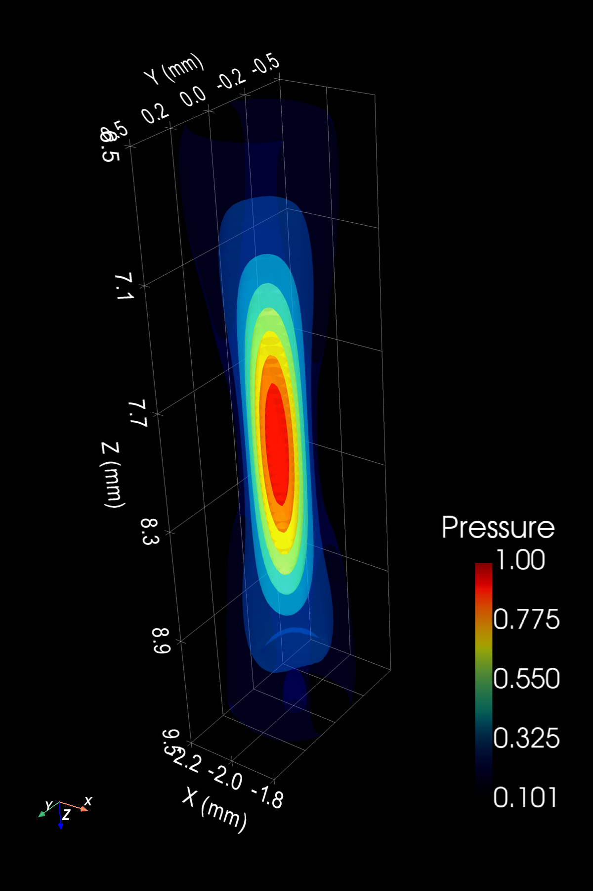

[Full example →](example4_multielement_transducers.md) · [Source on GitHub](https://github.com/EstebanRivera08/PyField/blob/main/examples/example4_multielement_transducers.py)

---

## 5. Transient (Pulsed) Simulation

Pulsed emission with a Hanning-windowed excitation.  The output is an animated
GIF showing the wavefront propagating through the medium.


[Full example →](example5_lineartx_transient.md) · [Source on GitHub](https://github.com/EstebanRivera08/PyField/blob/main/examples/example5_lineartx_transient.py)

---

## 6. Mouse Brain Atlas

A concave bowl transducer with its focal spot overlaid on a BrainGlobe mouse
brain atlas (`allen_mouse_25um`).  Anatomy, transducer, and pressure are
registered in the same coordinate frame.


[Full example →](example6_monoelement_mouse.md) · [Source on GitHub](https://github.com/EstebanRivera08/PyField/blob/main/examples/example6_monoelement_mouse.py)

---

## 7. Rat Brain Zone Targeting

Focused-ultrasound targeting of motor and somatosensory regions of a rat brain
(`whs_sd_rat_39um` atlas).  Includes atlas scaling by the lambda–bregma distance
and affine registration to the transducer frame.


[Full example →](example7_ratbrainzones_focus.md) · [Source on GitHub](https://github.com/EstebanRivera08/PyField/blob/main/examples/example7_ratbrainzones_focus.py)

---

## 8. STL Mesh Loading

Loading and visualising STL files of experimental components (petri dish).
Covers geometric transforms, multiple objects in one scene, mesh inspection,
and custom lighting.

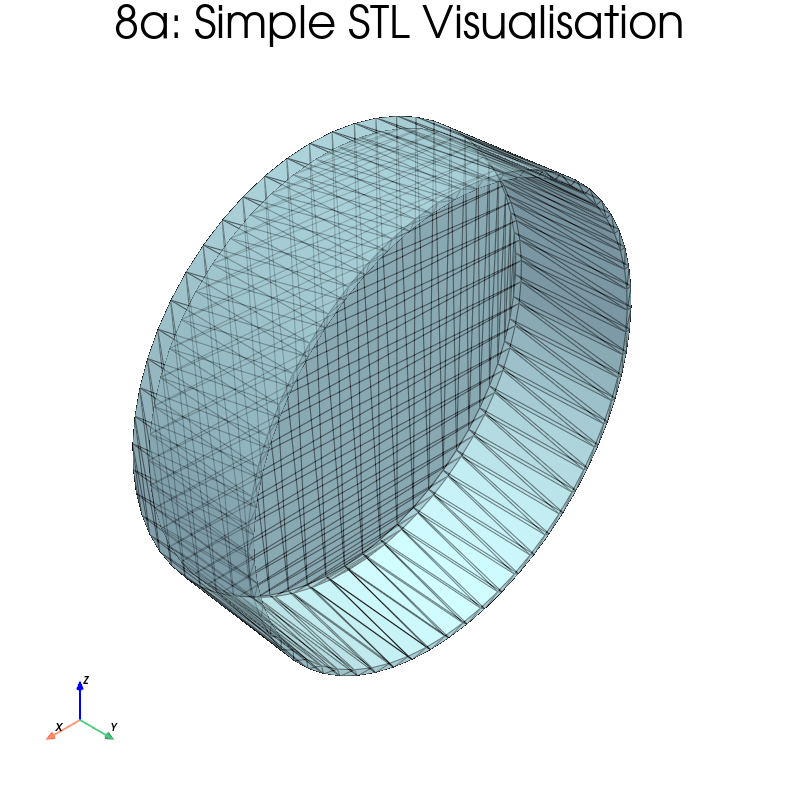
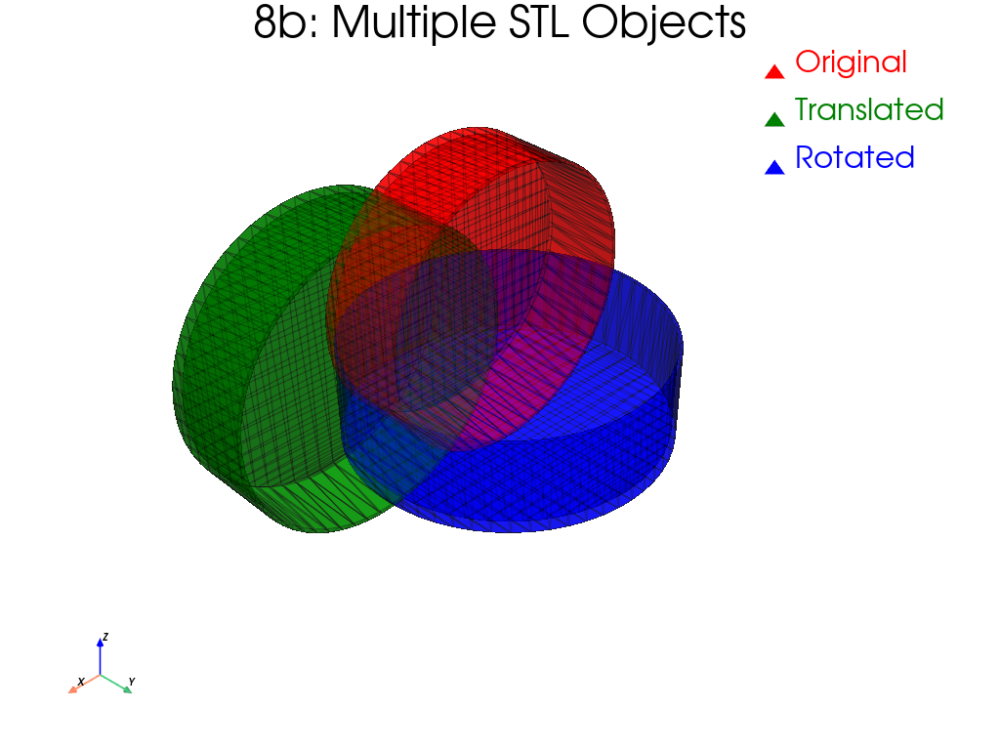
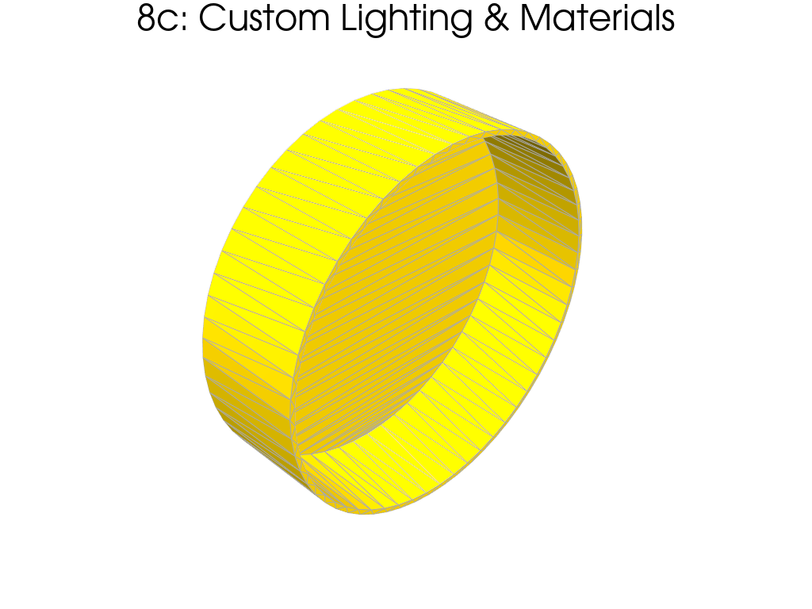

[Full example →](example8_importstl_petridish.md) · [Source on GitHub](https://github.com/EstebanRivera08/PyField/blob/main/examples/example8_importstl_petridish.py)

---

## 9. STL Mesh + Acoustic Simulation

End-to-end: concave bowl transducer, pressure field, and petri-dish STL all
composed in a single 3-D PyVista scene — the complete experimental setup.


[Full example →](example9_monoelement_petridish.md) · [Source on GitHub](https://github.com/EstebanRivera08/PyField/blob/main/examples/example9_monoelement_petridish.py)

---

## 10. Parametric Surface Subdivision in rectangular patches (for transducers)

Visulization of `subdivide_parametric_surface` special function for creation of
transducers. This function allows to approximate a curved surface with rectangular 
patches.

In this example, we use `subdivide_parametric_surface` directly on an ellipsoidal cap.
We aim to show how the arc-length adapted grid distributes patch centres uniformly, how
`patch_fill` controls coverage vs intersection risk, and the difference between
the theoretical curved surface and its flat-patch approximation.


[Full example →](example10_subdivide_parametric_surface.md) · [Source on GitHub](https://github.com/EstebanRivera08/PyField/blob/main/examples/example10_subdivide_parametric_surface.py)

---

## Prerequisites

| Examples | Requirements |
|----------|-------------|
| 1–5 | Core PyField installation |
| 6–7 | `brainglobe-atlasapi` (atlas data downloaded on first run) |
| 8–9 | `Petri_dish.stl` placed in `examples/` |
| 10 | Core PyField installation |
