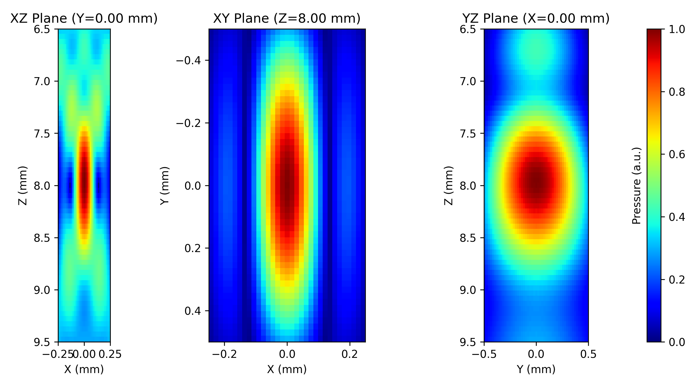

# PyField Documentation

PyField is a Python acoustic field simulator based on the Tupholme-Stepanishen
Spatial Impulse Response (SIR) method.  It models arbitrary transducer geometries
as collections of rectangular patches and computes pressure fields via convolution.

## Installation

```bash
uv add git+https://github.com/EstebanRivera08/PyField.git
```

Or, inside the cloned repository:

```bash
uv sync
```

## Quick start

```python
import numpy as np
from pyfield.psimulation import PyField
from pyfield.transducers import LinearArrayTransducer
from pyfield.utilities import plot_slices_2d

# Define transducer
tx = LinearArrayTransducer(
    n_elements=64,
    element_width_mm=0.25,
    element_height_mm=12.0,
    kerf_mm=0.05,
    no_sub_x=2,
    no_sub_y=4,
    frequency_Hz=5e6,
)
tx.compute_delays(focus_mm=[0, 0, 30])
tx.compute_apodization(focus_mm=[0, 0, 30], FoverD=2.0)

# Define field grid (mm)
field_points = {
    "x_extent": [-5, 5],
    "y_extent": [-0.5, 0.5],
    "z_extent": [5, 55],
    "dx": 0.1,
    "dy": 1.0,
    "dz": 0.2,
}

# Run simulation
sim = PyField(tx)
x, y, z, p = sim(field_points, method="auto")

# Visualize
plot_slices_2d(x, y, z, p, db_scale=True, vmin=-40)
```



## Documentation sections

### User Guide

Conceptual guides to help you understand how PyField works:

| Page | Content |
|------|---------|
| [Getting Started](user-guide/getting-started.md) | Installation, first simulation, key concepts |
| [Transducers](user-guide/transducers.md) | How transducers work in PyField |
| [Simulation Modes](user-guide/simulation.md) | Monochromatic vs transient simulations |
| [Visualization](user-guide/visualization.md) | 2D and 3D plotting guide |

### Examples

Worked examples that progressively introduce PyField's features:

| Page | Content |
|------|---------|
| [Examples Overview](examples/index.md) | Learning path from basic geometry to brain-atlas integration |

### API Reference

Detailed function and class documentation:

| Page | Content |
|------|---------|
| [Transducers](api/transducers.md) | All transducer types and their parameters |
| [Simulation](api/simulation.md) | PyField simulator -- methods, excitation, output |
| [Visualization](api/visualization.md) | Matplotlib and PyVista plotting functions |
| [Brain Atlas](api/brain_atlas.md) | BG_Atlas -- anatomical atlas registration |

### Contributing

| Page | Content |
|------|---------|
| [Contributing Guide](contributing.md) | Development setup, code style, PR workflow |

## Citation

If you use PyField in your research, please cite it using the following reference:

<!-- citation text will be added here -->

```bibtex
% BibTeX entry will be added here
```
