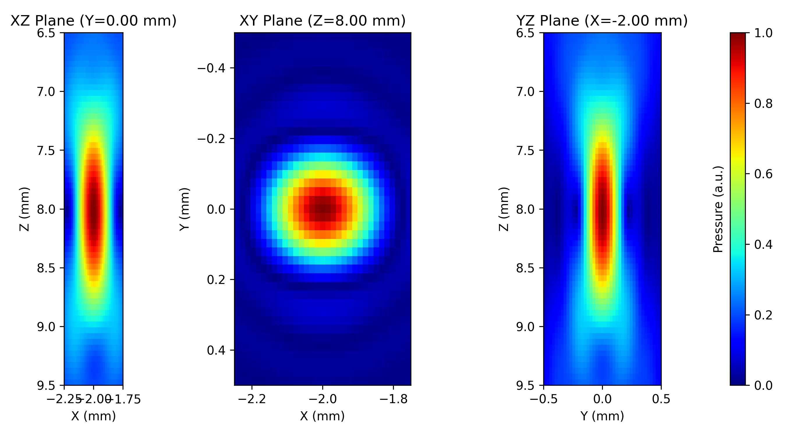

# Simulation

## PyField

`PyField` wraps the SIR kernel and provides a callable interface.

```python
from pyfield.psimulation import PyField

sim = PyField(transducer)
x_out, y_out, z_out, pressure = sim(field_points_mm, method="auto")
```

### Arguments

| Parameter | Type | Description |
|-----------|------|-------------|
| `transducer` | `TransducerBase` | Any configured transducer |

### `__call__(field_points_mm, *, method, excitation)`

| Parameter | Type | Description |
|-----------|------|-------------|
| `field_points_mm` | `(N,3) ndarray` | Field point coordinates in mm |
| `method` | `str` | `"naive"`, `"SDI"`, or `"auto"` |
| `excitation` | `ndarray or None` | Excitation pulse for transient simulation |

**Return values**

| Symbol | Shape | Description |
|--------|-------|-------------|
| `x_out, y_out, z_out` | 1-D | Unique coordinate axes extracted from `field_points_mm` |
| `pressure` | `(Nx,Ny,Nz)` or `(Nt,Nx,Ny,Nz)` | Pressure field |

### Methods

| Name | Description |
|------|-------------|
| `"naive"` | Direct evaluation — O(M·P) |
| `"SDI"` | Sub-aperture decomposition — same result, faster for dense grids |
| `"auto"` | Picks the faster method based on `M` and `P` |

---

## Monochromatic simulation

Set up the transducer and call without an excitation signal.  The output is a
3-D complex pressure field (envelope).

```python
sim = PyField(tx)
x, y, z, p = sim(pts_mm, method="auto")
# p.shape == (Nx, Ny, Nz)
```

**Linear array — XZ plane (Domino probe)**


**Linear array — 3-D isosurface view (TX + pressure)**


**Matrix array — three orthogonal planes (Zeus_Matrix)**



**Matrix array — 3-D isosurface view (TX + pressure)**


---

## Transient simulation

Pass a time-domain excitation pulse.  The output is a 4-D real pressure field
with time along axis 0.

```python
import numpy as np

fs = 100e6           # sampling frequency
fc = tx.fc           # centre frequency
n_cycles = 3
t_pulse = np.arange(0, n_cycles / fc, 1 / fs)
excitation = np.sin(2 * np.pi * fc * t_pulse) * np.hanning(len(t_pulse))

x, y, z, p = sim(pts_mm, method="auto", excitation=excitation)
# p.shape == (Nt, Nx, Ny, Nz)
```

---

## Field grid helper

Build a dense 3-D grid of points:

```python
import numpy as np

x = np.linspace(-5, 5, 40)
y = np.array([0.0])          # single plane
z = np.linspace(5, 60, 120)
pts = np.array(np.meshgrid(x, y, z)).T.reshape(-1, 3)
```

---

## Delta-k diagnostic

After a simulation, inspect `sim.sub_elem_delta_k` to verify the SIR
accuracy condition for every patch and field point.  Use
`plot_deltak_distribution(sim)` for a visual summary.

```python
from pyfield.utilities import plot_deltak_distribution

fig = plot_deltak_distribution(sim, per_element=True)
```
