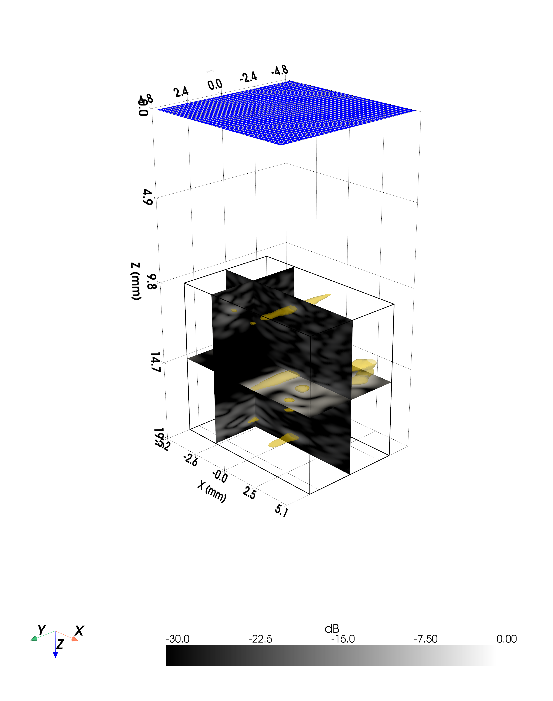

# 3D Planes

3-D plane rendering places flat cross-section slices inside a PyVista 3-D scene. This is useful for showing the focal spot in the context of surrounding anatomy or experimental geometry. See the [Custom sparse array](../examples/example18_customtransducer_3Dplanes.md) and [STL + Simulation](../examples/example15_monoelement_petridish.md) examples for working code.

Unlike [3D Volume](3d-volume.md) isosurfaces, plane views preserve the exact field values at each slice position without interpolation artefacts from isosurface meshing.

| | |
|---|---|
|  |  |
