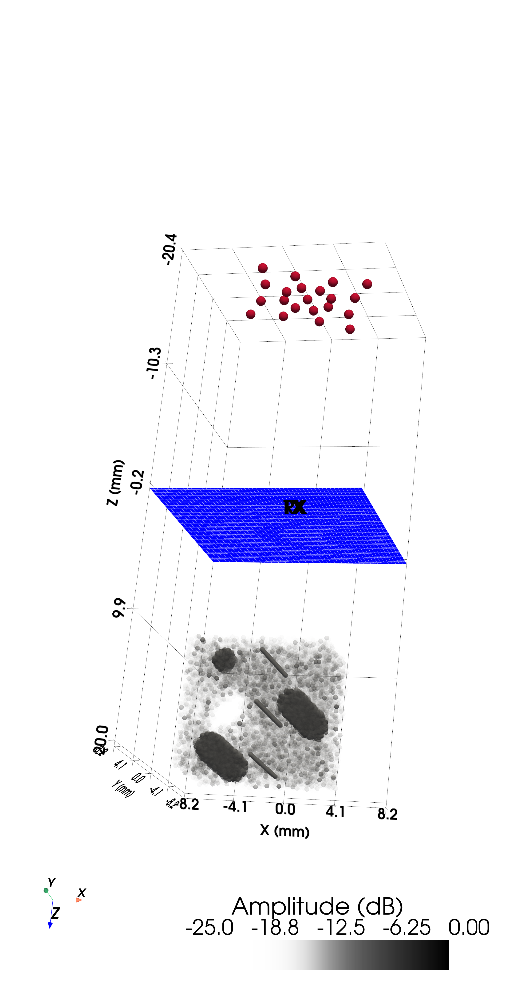

# 3D Volume

The PyVista backend renders the full 3-D pressure volume as isosurfaces, enabling interactive exploration of the focal region. See the [Multi-element 3-D example](../examples/example03_multielements_monochromatic_CW.md) for working code.

```python
from pyfield.plotting import plot3D_pressure_vol

pl = plot3D_pressure_vol(p, x=x, y=y, z=z, contour_levels=11)
pl.show()
```


Transient volumes animate the propagating wavefront:


For imaging studies, the same scene shows a 3-D scatterer phantom together with the
matrix probe — here a Zeus matrix array above a speckle phantom with anechoic targets
and wires:



Beamforming the received echoes reconstructs the full 3-D B-mode volume — here the
Zeus matrix array resolving anechoic targets and wires inside the speckle:


### Composing scenes

```python
import pyvista as pv
from pyfield.plotting import add_pressure_vol, add_transducer_mesh, create_3Dvol_mesh

pl = pv.Plotter()
mesh = create_3Dvol_mesh(coords["x"], coords["y"], coords["z"], p)
pl = add_pressure_vol(mesh, plotter=pl)
pl = add_transducer_mesh(tx.get_mesh(), plotter=pl)
pl.show()
```
