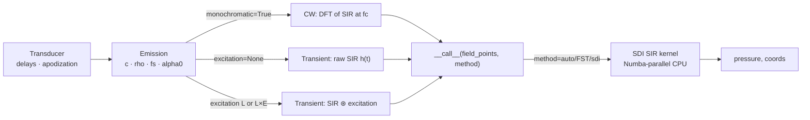
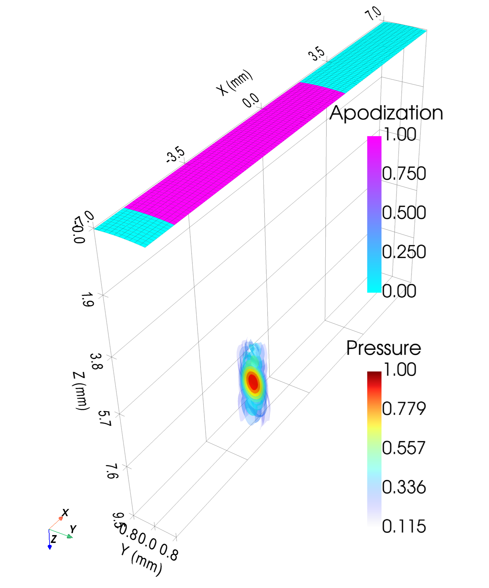
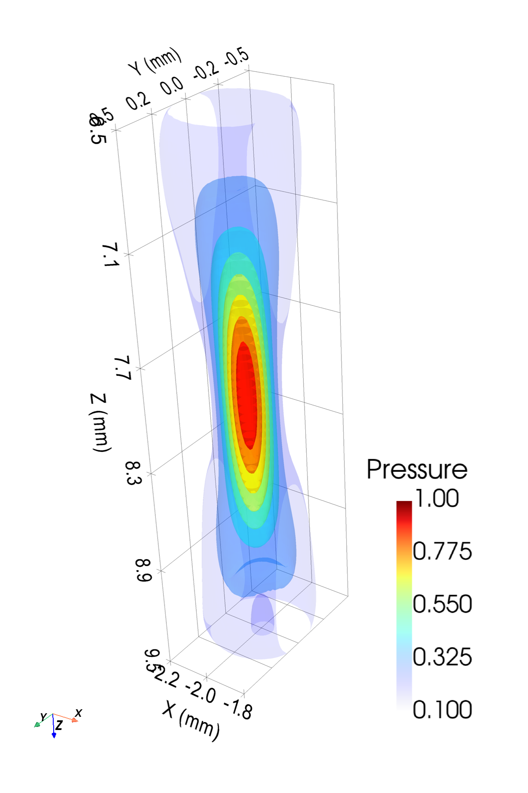
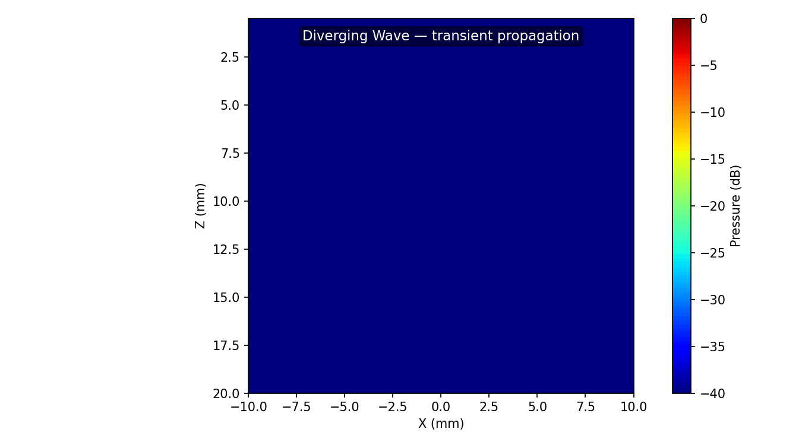

# Emission

`Emission` computes the pressure field **radiated** by a transducer. One callable
covers four modes, selected by constructor flags; `__call__` always returns
`(pressure, coords)`.

```python
from esdiva.emission import Emission

sim = Emission(tx, monochromatic=True)          # CW amplitude at fc  → (Nx, Ny, Nz)
sim = Emission(tx)                              # pulsed transient (raw SIR) → (Nt, …)
sim = Emission(tx, fs=200e6, excitation=exc)     # global excitation (L,)
sim = Emission(tx, fs=200e6, excitation=exc_LE)  # per-element excitation (L, E)

p, coords = sim(field_points, method="auto")
```

## Algorithmic flow



## Modes at a glance

| Constructor | Output shape | `coords` | Page |
|-------------|--------------|----------|------|
| `monochromatic=True` | `(Nx, Ny, Nz)` | `x, y, z` | [Monochromatic](monochromatic.md) |
| default (`excitation=None`) | `(Nt, Nx, Ny, Nz)` | `+ t0, dt` | [Transient Impulse](transient-impulse.md) |
| `excitation=(L,)` or `(L, E)` | `(Nt, Nx, Ny, Nz)` | `+ t0, dt` | [Transient + Excitation](transient-excitation.md) |
| `alpha0=…` | as above | as above | [Attenuation](attenuation.md) |

Raw `(N, 3)` input drops the spatial axes: `(N_points,)` / `(Nt, N_points)`.

## Continuous-wave field

Fast steady-state amplitude at the centre frequency — ideal for beam patterns and
focal-spot characterisation.





## Transient field

Convolve the SIR with an excitation pulse for the full time-domain wavefront —
diverging waves, steered plane waves, propagation snapshots.



## Key parameters

| Parameter | Role |
|-----------|------|
| `monochromatic` | CW amplitude vs transient waveform |
| `excitation` | `None` (raw SIR), `(L,)` global, or `(L, E)` per-element |
| `fs` | Time sampling for transient / attenuation |
| `alpha0`, `freq_power` | Power-law attenuation (see [Attenuation](attenuation.md)) |
| `method` | `"auto"` / `"FST"` / `"sdi"` on the SIR kernel |

Full signature and every parameter: [API → Emission](../api/emission.md).
