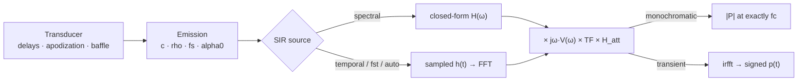

# Emission

`Emission` computes the pressure field **radiated** by a transducer. One callable
covers four modes, selected by constructor flags; `__call__` always returns
`(pressure, coords)`.

```python
from esdiva.emission import Emission

sim = Emission(tx, monochromatic=True)          # |P(r, fc)| → (Nx, Ny, Nz)
sim = Emission(tx)                              # pulsed transient (raw SIR) → (Nt, …)
sim = Emission(tx, fs=200e6, excitation=exc)     # global excitation (L,)
sim = Emission(tx, fs=200e6, excitation=exc_LE)  # per-element excitation (L, E)

p, coords = sim(field_points)                    # method: None = fastest for the mode
```

Physics: `P(r, ω) = ρ₀ · jω·V(ω) · H(r, ω)` — the velocity pulse `v` (excitation ⊛
impulse response) times the aperture's spatial impulse response `H`. Transfer functions
(attenuation, a user `transfer_function`, per-element drives) multiply in the same
frequency domain. Transient pressure is **signed** (compression > 0, rarefaction < 0)
and in **pascals** for `rho` in kg/m³ and a velocity in m/s, independent of `fs`.

## Algorithmic flow



## Modes at a glance

| Constructor | Output | `coords` | Page |
|-------------|--------|----------|------|
| `monochromatic=True` | `(Nx, Ny, Nz)`, `ρ·ωc·\|H\|` per 1 m/s | `x, y, z` | [Monochromatic](monochromatic.md) |
| default (`excitation=None`) | `(Nt, Nx, Ny, Nz)`, `ρ·h(t)` | `+ t0, dt` | [Transient Impulse](transient-impulse.md) |
| `excitation=(L,)` or `(L, E)` | `(Nt, Nx, Ny, Nz)`, signed Pa | `+ t0, dt` | [Transient + Excitation](transient-excitation.md) |
| `alpha0=…` | as above | as above | [Attenuation](attenuation.md) |

Raw `(N, 3)` input drops the spatial axes: `(N_points,)` / `(Nt, N_points)`.

## Monochromatic field

Steady-state amplitude at exactly the centre frequency — ideal for beam patterns and
focal-spot characterisation.


## Transient field

Convolve the SIR with an excitation pulse for the full time-domain wavefront —
diverging waves, steered plane waves, propagation snapshots.


## SIR source: spectral or temporal

Both evaluate the same far-field trapezoidal SIR and agree to about 1 %:

- `"spectral"` — the closed-form spectrum `H(ω)` (per patch: area × two sincs × a delay
  phasor), exact, evaluated only on the pulse's frequencies.
- `"temporal"` (= `"sdi"`), `"fst"`, `"auto"` — the sampled `h(t)`, then an FFT.

The default `method=None` picks the faster: spectral for monochromatic fields and for
per-element drives or attenuation, temporal for every other transient field.

## Key parameters

| Parameter | Role |
|-----------|------|
| `monochromatic` | Amplitude at `fc` vs transient waveform |
| `excitation` | `None` (raw SIR), `(L,)` global, or `(L, E)` per-element |
| `fs` | Time sampling for transient output |
| `alpha0`, `freq_power` | Power-law attenuation (see [Attenuation](attenuation.md)) |
| `fast_attenuation` | Attenuation path from the transducer centre (`True`) or each element |
| `transfer_function` | Extra frequency response `TF(f)` (applied at `fc` in monochromatic mode) |
| `method` | `None` (fastest), `"spectral"`, `"temporal"`, `"fst"`, `"auto"` |
| `tx.baffle` | `"rigid"` (default) or `"soft"` (`cosθ` obliquity per patch) |

Full signature and every parameter: [API → Emission](../api/emission.md).
