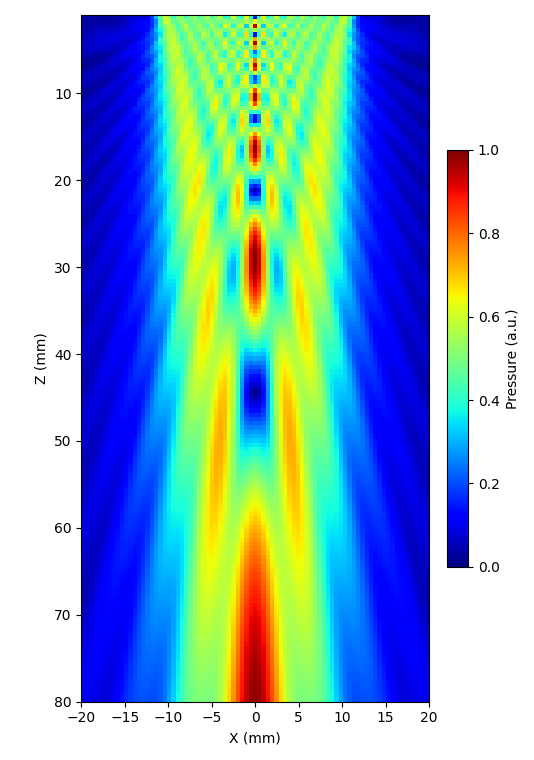
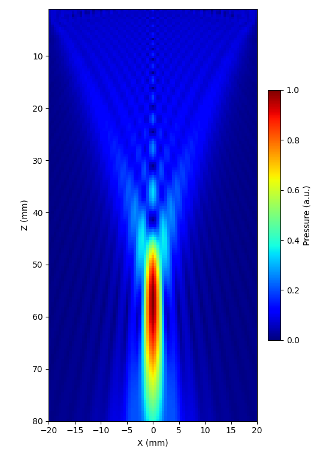
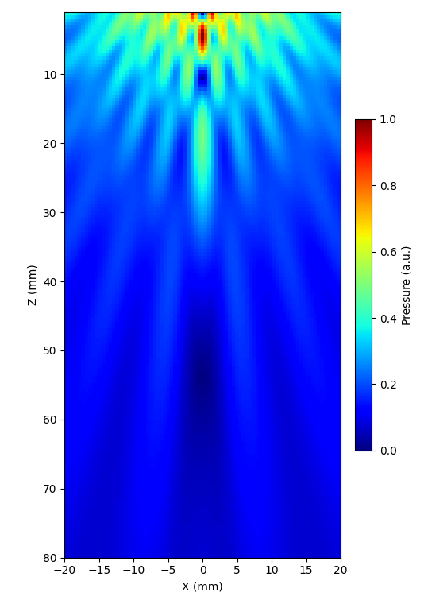
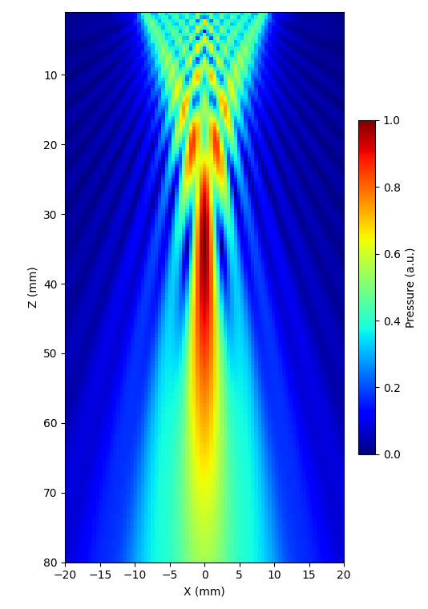

# Mono-element Transducers

Single-element circular transducers. Focusing comes from the physical curvature of
the surface, not electronic delays. See the [Transducers API](../api/transducers.md)
for full parameters and [Example 2 — Mono-element Fields](../examples/example02_monoelements_monochromatic_CW.md).

| | |
|---|---|
|  |  |
|  |  |

## At a glance

| Type | Shape | Focusing |
|------|-------|---------|
| `FlatCircularTransducer` | Flat disk | None — diverging field |
| `ConcaveCircularTransducer` | Spherical bowl | Geometric (focus at z > 0) |
| `ConvexCircularTransducer` | Spherical dome | Geometric (diverging) |
| `FocusedCircularTransducer` | Cylindrical arc | Line-focus along one axis |

All mono-element transducers have `n_elements = 1`. Electronic delays have no effect — focusing is achieved through the physical curvature of the surface.

### Z-convention

For all curved circular transducers the **rim is at z = 0**. The `focus_mm` parameter sets the axial depth from the rim to the geometric focus:

```python
tx = ConcaveCircularTransducer(
    diameter_mm=64.0,
    focus_mm=63.0,   # depth from rim to focus
    frequency_Hz=0.5e6,
    no_sub_diameter=30,
)
```
