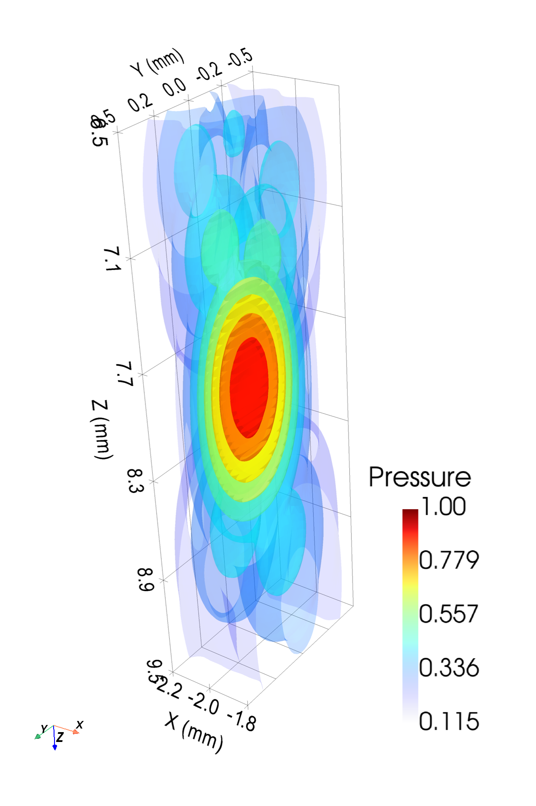

# Multi-element Transducers

Arrays of independently driven elements — electronic steering and focusing via
per-element delays and apodization. See the
[Transducers API](../api/transducers.md) and
[Example 3 — Multi-element 3-D](../examples/example03_multielements_monochromatic_CW.md).

| | |
|---|---|
|  |  |

## At a glance

| Type | Layout | Steering |
|------|--------|---------|
| `LinearArrayTransducer` | 1-D row along X | Lateral + depth (XZ) |
| `ConvexArrayTransducer` | Elements on convex arc | Wide-angle sector |
| `MatrixArrayTransducer` | 2-D grid of elements | Full 3-D volumetric |
| `CustomTransducer` | Arbitrary positions | Per-element definition |

## Basic usage

```python
from pyfield.transducers import LinearArrayTransducer

tx = LinearArrayTransducer(
    n_elements=64,
    element_width_mm=0.25,
    element_height_mm=12.0,
    kerf_mm=0.05,
    no_sub_x=2,
    no_sub_y=4,
    frequency_Hz=5e6,
)

# Focus at (x=0, y=0, z=30 mm)
tx.compute_delays(focus_mm=[0, 0, 30])
tx.compute_apodization(focus_mm=[0, 0, 30], FoverD=2.0)
```

Delays and apodization can be recomputed for any focal point without recreating the transducer object.
