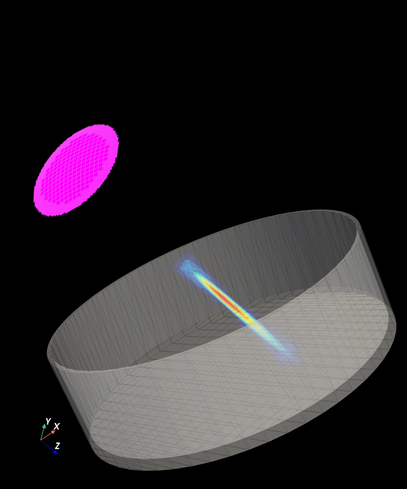

# PyVista Integration

eSDIva's PyVista helpers compose rich 3-D scenes combining:

- **Pressure volumes** — isosurfaces or volumetric rendering of `p(x, y, z)`
- **Transducer meshes** — patch geometry coloured by apodization or delays
- **STL meshes** — arbitrary experimental geometry (e.g., petri dishes, phantoms)
- **Brain anatomy** — atlas-registered anatomical structures

All helpers operate on a shared `pv.Plotter` instance, so scenes are built incrementally and rendered in a single interactive window. See the [STL Meshes](../examples/example14_importstl_petri_dish.md) and [STL + Simulation](../examples/example15_monoelement_petridish.md) examples for working code.

| | |
|---|---|
|  |  |

## All PyVista functions

Every public scene helper (`add_*` composers in `plotting_pyvista.py`) and mesh
builder (`create_*` / `load_*` in `pyvista_functions.py`) is listed with full
signatures and parameters under
[API → Plotting → PyVista scene helpers](../api/plotting.md#pyvista-scene-helpers)
and [PyVista mesh builders](../api/plotting.md#pyvista-mesh-builders). These are the
building blocks worth reaching for when composing custom 3-D figures.
