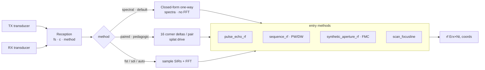
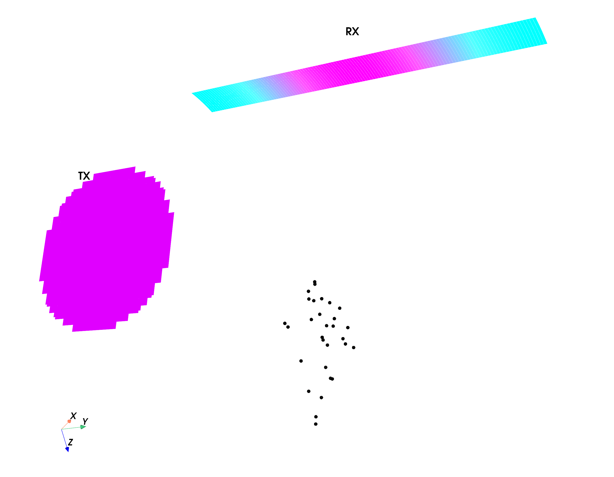
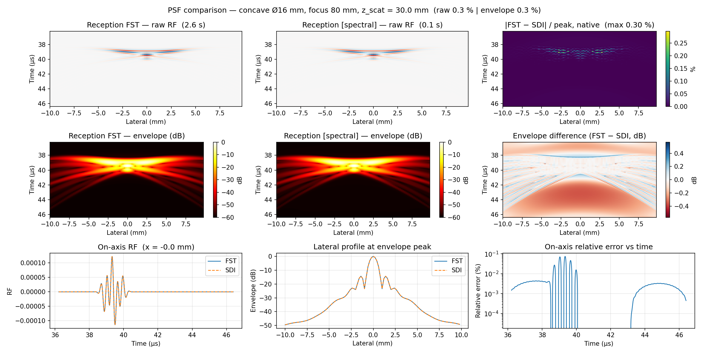

# Reception (RF)

Reception computes the **pulse-echo RF** scattered by point targets back onto the
receive elements — the raw channel data a scanner would digitise. It is the basis
for PSF, phantom, FMC, and sequence (PW/DW) imaging studies, and matches Field II
to correlation ~1.0 while running **>20× faster** on large apertures.

One class, `Reception`, does everything; its `method` selector picks how the two-way
SIR is evaluated (speed only — all give the same RF):

- **`"spectral"`** (default) — fast sparse-delta kernel via closed-form one-way SIR spectra.
- **`"fst"` / `"sdi"` / `"auto"`** — conventional Tupholme-Stepanishen sampled convolution.
- **`"paired"`** — exact but slow pedagogic reference (warns on selection).

```python
from sondi.reception import Reception

sim = Reception(tx, rx, fs=200e6, c=1540)             # separate TX / RX transducers
rf, coords = sim.pulse_echo_rf(scatterer_pos_mm, scatterer_amp)   # (Erx, Nt)
```

The physics: the pulse-echo signal is `v_pe ⊛ h_tx ⊛ h_rx`, with the excitation
and TX/RX impulse responses carrying the band-limited pulse (same convention as
Field II — no explicit derivative applied).

## Algorithmic flow



## Entry methods

| Method | Purpose | Returns |
|--------|---------|---------|
| `pulse_echo_rf` | Single transmit; core call. `per_scatterer=True` → PSF | `(Erx, Nt)` / `(P, Erx, Nt)` |
| `sequence_rf` | PW/DW event sweep; `out_path=` checkpoints each event | `(Nevt, Erx, Nt)` |
| `synthetic_aperture_rf` | FMC — per-element transmit basis | `(Etx, Erx, Nt)` |
| `scan_focusline` | One focused B-mode line, RX summed in-kernel | `(Nt,)` |

The `method=` flag (`spectral` / `fst` / `sdi` / `auto` / `paired`) only trades
speed — all produce the same RF. `paired` is a slow pedagogic reference and warns
on selection.

## Scatterers, PSF, and phantoms

- **PSF** — pass field points and `per_scatterer=True` to get each target's
  point-spread response. A grid dict gives a regular lattice of unit targets.
- **Phantoms** — `sondi.utilities.make_phantom(extents_mm, n, echogenicity_map)`
  returns random positions with `N(0,1)·map(r)` amplitudes → realistic speckle.

```python
from sondi.utilities import make_phantom

pos, amp = make_phantom(extents_mm, n=20000, echogenicity_map=my_map)
rf, coords = sim.pulse_echo_rf(pos, amp)
```

!!! warning "Lattice ≠ phantom"
    A periodic grid of scatterers gives *coherent* echoes (PSF maps), not speckle.
    Use `make_phantom` for speckle statistics.

## Preview the setup

`sim.show(scatterer_positions_mm, amplitudes)` renders TX/RX meshes and the
scatterer cloud in 3-D — run it before a long simulation.



## Examples

| Figure | Study |
|--------|-------|
|  | [PSF vs Field II](../examples/example06_concave_PSF.md) |
|  | [Full Matrix Capture](../examples/example08_synthetic_aperture_FMC.md) |
|  | [Speckle phantom](../examples/example20_phantom_simulation.md) |

## Beamforming note

The RF is referenced to the **geometric** round-trip time. The built-in DAS
beamformers (`das_volume`, `das_rca_volume`) auto-apply `coords["pulse_center_lag_s"]`
(the half-pulse envelope delay); a custom beamformer must add it itself.

Full signatures: [API → Reception](../api/reception.md) · [API → Beamforming](../api/beamforming.md).
