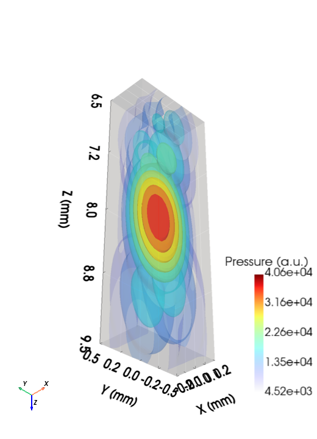
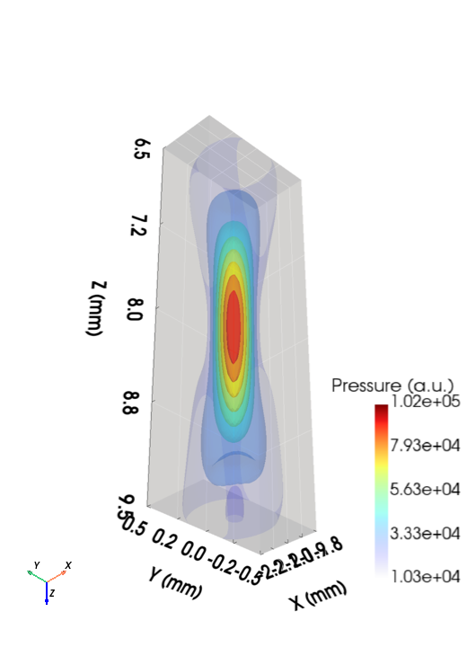

# Visualization

PyField provides two sets of plotting helpers:

- **Matplotlib** (`pyfield.utilities`) — 2-D static figures, fast and
  notebook-friendly.
- **PyVista** (`pyfield.utilities`) — interactive 3-D rendering.

---

## Matplotlib functions

### `plot_pressure_planes`

Three orthogonal slices through a pressure volume (XZ, XY, YZ).

```python
from pyfield.utilities import plot_pressure_planes

plot_pressure_planes(
    x, y, z, pressure_field,
    db_scale=True,
    centered_to_max=True,
    vmin=-40, vmax=0,
    label="Pressure (dB)",
    save_fig_name="field.png",
)
```

Works with both 3-D (monochromatic) and a single-plane 2-D slice
(one dimension equal to 1).

### `plot_slices_2d`

Unified interface for monochromatic (3-D) and transient (4-D) data.

For 3-D data a static figure is produced via `plot_pressure_planes`.
For 4-D data a `FuncAnimation` is displayed: all `Nt` frames are spread
evenly over `video_duration_s` seconds, so the animation always finishes
in the requested duration regardless of frame count.

```python
from pyfield.utilities import plot_slices_2d

# Monochromatic (3-D)
plot_slices_2d(x, y, z, p_mono, db_scale=True, vmin=-30)

# Transient (4-D) — 5-second animation, saves mp4 if save_dir given
plot_slices_2d(
    x, y, z, p_transient,
    time_array=time_s,           # physical time axis (seconds)
    db_scale=True,
    video_duration_s=5,          # all frames shown in 5 s
    save_dir="./frames",         # optional: save mp4 to this directory
    vmin=-40, vmax=0,
    cmap="jet",
)
```

`pressure_field` conventions:
- 3-D `(Nx, Ny, Nz)` — monochromatic
- 4-D `(Nt, Nx, Ny, Nz)` — transient (time along axis 0)

Planar fields (one spatial dimension = 1) are detected automatically and
displayed as a single panel instead of three orthogonal views.

Key parameters:

| Parameter | Default | Description |
|-----------|---------|-------------|
| `video_duration_s` | `5` | Total animation length in seconds.  Display interval = `video_duration_s / Nt` per frame. |
| `fps` | `30` | Reserved for API compatibility.  Save fps is derived from `Nt / video_duration_s`. |
| `save_dir` | `None` | Directory for output.  Saves `pressure_field_video.mp4` (ffmpeg) or `.gif` (pillow fallback). |
| `vmin`, `vmax` | auto | Colorbar limits (applied consistently across all frames). |
| `centered_to_max` | `False` | Slice planes through pressure maximum (True) or geometric centre (False). |

### `plot_pressure_field`

High-level wrapper for 3-D interactive/off-screen rendering of a pressure
volume.  Creates the mesh, adds isosurface contours, applies axis styling, and
returns the plotter so you can compose additional actors before calling
`.show()`.

```python
from pyfield.utilities import plot_pressure_field, add_transducer_mesh

# standalone 3-D pressure view
pl = plot_pressure_field(x, y, z, pressure_field,
                         contour_levels=11,
                         colorbar_title="Pressure (a.u.)")
pl.show()

# compose with transducer mesh
pl = plot_pressure_field(x, y, z, p, contour_levels=11)
pl = add_transducer_mesh(tx.get_mesh(), plotter=pl)
pl.show()
```

**Linear array (Domino) — TX + pressure, 3-D view**



**Matrix array (Zeus_Matrix) — TX + pressure, 3-D view**



### `plot_deltak_distribution`

Diagnostic plot showing the Δk condition across all patches and field points.

```python
from pyfield.utilities import plot_deltak_distribution
fig = plot_deltak_distribution(sim, per_element=True)
```

---

## PyVista functions

All PyVista functions accept an optional `plotter` argument so multiple
objects can be composed in a single scene.

### `create_vol_mesh`

Convert a pressure array to a `pv.ImageData` mesh (prerequisite for volume
rendering).

```python
from pyfield.utilities import create_vol_mesh
mesh = create_vol_mesh(x, y, z, pressure_field, scalars="Pressure")
```

### `plot_pressure_field`

High-level wrapper: creates the mesh, adds isosurface contours, sets axis
labels, and returns the plotter.

```python
from pyfield.utilities import plot_pressure_field
plotter = plot_pressure_field(x, y, z, pressure_field,
                              colorbar_title="Pressure (a.u.)",
                              contour_levels=15)
plotter.show()
```

### `add_pressure_vol`

Add a pressure mesh (contour isosurfaces) to an existing plotter.

```python
from pyfield.utilities import add_pressure_vol, create_vol_mesh
mesh = create_vol_mesh(x, y, z, p)
pl = add_pressure_vol(mesh, colorbar_title="Pressure")
```

### `add_transducer_mesh`

Render the transducer geometry coloured by apodization or delays.

```python
from pyfield.utilities import add_transducer_mesh
tx_mesh = tx.get_mesh()
pl = add_transducer_mesh(tx_mesh, scalars="Apodization")
pl = add_transducer_mesh(tx_mesh, plotter=pl, scalars="Delays")
```

### `add_3D_vol`

Volume rendering of arbitrary 3-D scalar data (e.g. Doppler volumes).

```python
from pyfield.utilities import add_3D_vol
pl = add_3D_vol(vol_mesh, colorbar_title="Doppler (dB)", cmap="hot")
```

### `add_2D_image`

Render a 2-D `pv.ImageData` as a flat mesh (e.g. a B-mode image).

```python
from pyfield.utilities import add_2D_image
pl = add_2D_image(image_grid, colorbar_title="B-mode (dB)", cmap="gray")
```

### `add_regions_mesh`

Render a dictionary of brain region meshes from `BG_Atlas.pv_mesh`.

```python
from pyfield.utilities import add_regions_mesh
pl = add_regions_mesh(atlas.pv_mesh, opacity=0.3)
```

### `add_markers`

Scatter sphere markers with optional text labels.

```python
from pyfield.utilities import add_markers
pl = add_markers(points_mm, color="red", point_size=12,
                 labels=["A", "B", "C"], label_font_size=14)
```

### `recompute_bounds`

Return the bounding box of all meshes currently in a plotter.

```python
from pyfield.utilities import recompute_bounds
bounds = recompute_bounds(plotter)  # (xmin, xmax, ymin, ymax, zmin, zmax)
```

---

## Brain atlas scenes

Combine `add_regions_mesh`, `add_transducer_mesh`, and `add_pressure_vol` to
overlay anatomy, probe geometry, and simulated pressure in one interactive
scene.  See [brain_atlas.md](brain_atlas.md) for the registration step that
maps the atlas into the lab coordinate frame.

**Rat brain (whs_sd_rat_39um) — Domino linear array focused at M1/S1**


**Mouse brain (allen_mouse_25um) — circular transducer focused at CA1**


---

## Composing scenes

```python
import pyvista as pv
from pyfield.utilities import (
    add_pressure_vol, add_transducer_mesh, add_regions_mesh, create_vol_mesh
)

pl = pv.Plotter(window_size=[900, 700])
pl = add_regions_mesh(atlas.pv_mesh, plotter=pl, opacity=0.25)
pl = add_pressure_vol(create_vol_mesh(x, y, z, p), plotter=pl)
pl = add_transducer_mesh(tx.get_mesh(), plotter=pl)
pl.show()
```
