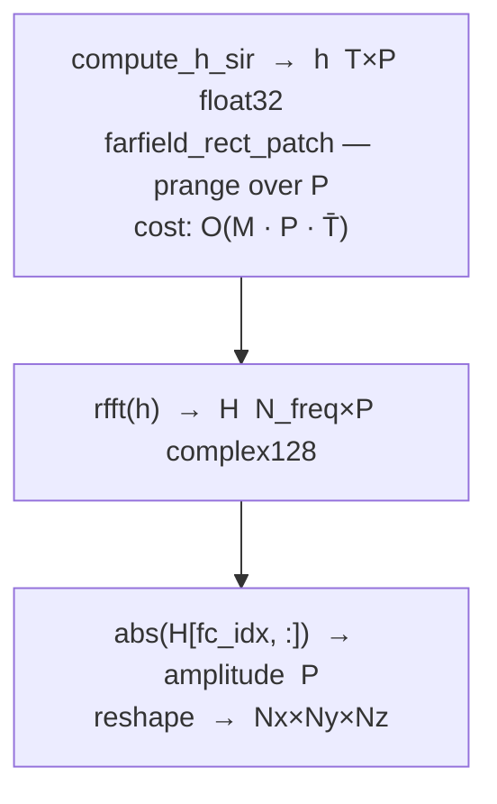
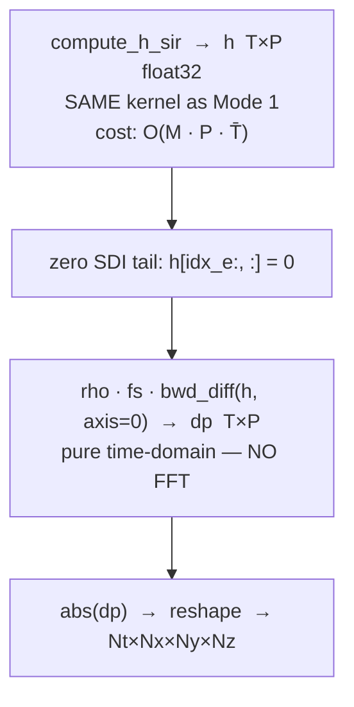
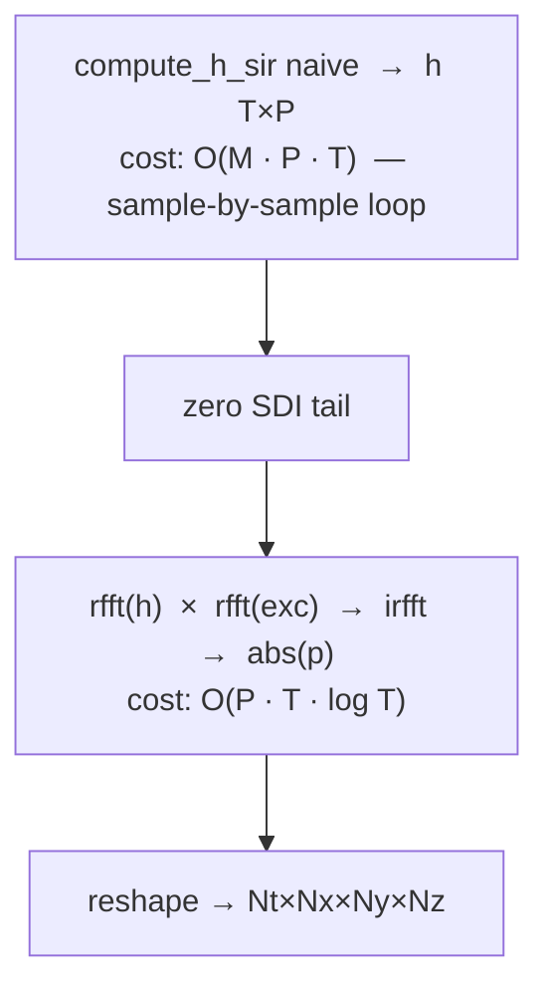
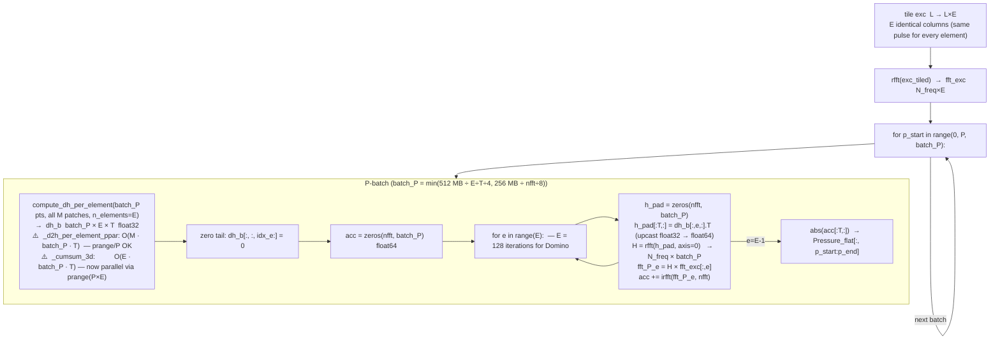
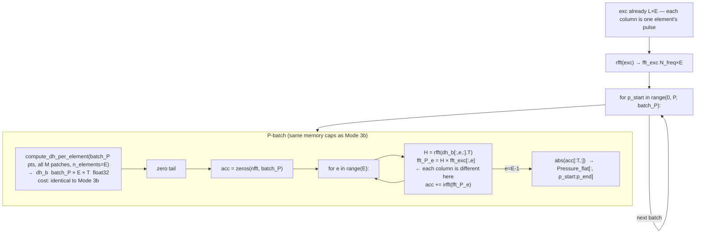
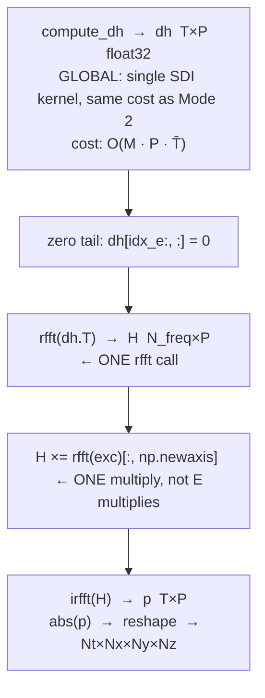

# Emission — Computation Flowchart

## Dispatch overview

```mermaid
flowchart TD
    A["Emission.__call__(field_points_mm, method)"]

    A --> PARSE

    subgraph PARSE["Input & Attenuation Setup"]
        P1{"dict input?"}
        P1 -->|yes| P2["parse grid dict<br/>→ x, y, z, points_m  shape P×3"]
        P1 -->|no|  P3["asarray / reshape<br/>→ points_m  shape P×3"]
        P2 & P3 --> P4{"alpha0 ≠ None?"}
        P4 -->|yes| P5["compute_attenuation_distances<br/>→ distances_m  shape P"]
        P4 -->|no|  P6["distances_m = None"]
    end

    PARSE --> DISP{"Mode dispatch<br/>(monochromatic, exc.ndim)"}

    DISP -->|"monochromatic=True"| M1
    DISP -->|"exc=None"| M2
    DISP -->|"exc.ndim=1, naive"| M3A
    DISP -->|"exc.ndim=1, sdi/auto"| M3B
    DISP -->|"exc.ndim=2"| M4
```

---

## Mode 1 — Monochromatic CW



**Key**: single SIR kernel + one FFT per column, then index at `fc`. No time-domain output.

---

## Mode 2 — Pulsed (raw SIR)



**Key**: identical SIR kernel as Mode 1. Differentiation is a finite-difference — trivial cost.

---

## Mode 3a — Global excitation, naive



---

## Mode 3b — Global excitation, SDI/auto  ⚠️ CURRENTLY SLOW



**Why so slow**: for global excitation the SDI kernel still computes **E separate dh arrays** (one per element, summing M/E patches each). The work is proportional to **E × P × T** — the same as Mode 4. Tiling to `(L, E)` doesn't reduce the SDI cost at all.

---

## Mode 4 — Per-element excitation  (L×E)



**Key**: per-element exc is the **natural and correct use case** for this code path. Every column of `fft_exc` is different, so E separate FFT multiplications are unavoidable.

---

## Summary: computational cost per mode

| Mode | SDI kernel | SDI output size | FFTs | Expected time |
|------|-----------|-----------------|------|---------------|
| 1 — CW | global `compute_h_sir` | T×P | 1 per P col | fast |
| 2 — Pulsed | global `compute_h_sir` | T×P | none (bwd_diff only) | **baseline** |
| 3a — Global, naive | global `compute_h_sir` naive | T×P | 1 per P col | slow (naive SIR) |
| **3b — Global, SDI** | **per-element `compute_dh_per_element`** | **T×P×E ← !** | **E per batch** | **~E× too slow** |
| 4 — Per-element | per-element `compute_dh_per_element` | T×P×E | E per batch | expected (unavoidable) |

---

## What Mode 3b SHOULD do



Expected timing: **Mode 2 time + FFT overhead** (a few seconds, not ~200 s).

**Why it isn't done this way**: the test `test_uniform_per_element_matches_global` checks
that the global path and per-element path agree to `rtol=1e-3`. Due to `fastmath=True`
floating-point reordering, `_compute_d2h_ppar` (global) and the sum of
`_compute_d2h_per_element_ppar` differ by 1 ULP (~4096 at float32 scale of ~3.5×10¹⁰).
After cumsum this propagates as a constant offset (~6144) in an intermediate plateau of dh.
After convolution + abs, this tiny absolute difference causes large *relative* differences
near zero crossings → `rtol=1e-3` fails even though the signals are physically equivalent.

The fix is to restore the fast global dh path and relax the test metric (use `atol` on the
absolute pressure error, or compare peak-normalised energy rather than pointwise `rtol`).
